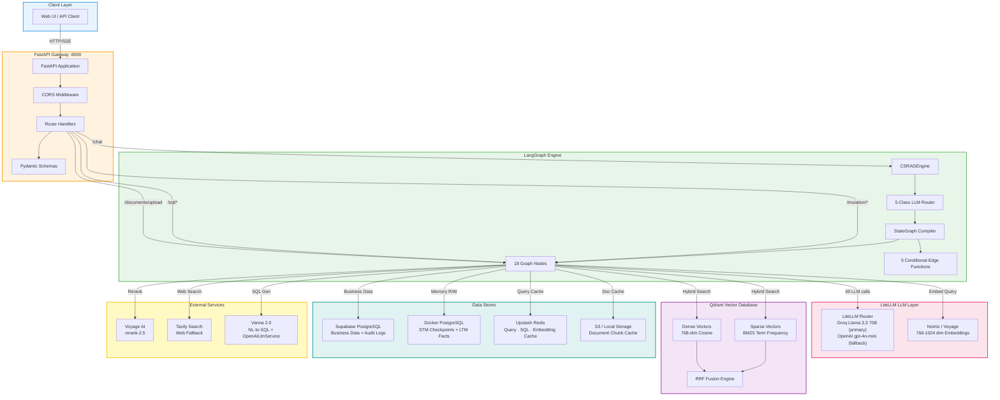

# 01 — System Architecture

**Project:** Intelligent Data Operations Platform (IDOP)
**Version:** 0.1.1
**Last Updated:** 2026-06-15

---

## Overview

IDOP is an enterprise-grade agentic platform that replaces routine data analyst workflows with three core AI-driven features and two additional processing paths:

1. **NL-to-SQL** — Natural language queries translated to validated SQL, executed after human approval
2. **Document-Driven Mutations** — Excel/CSV uploads parsed, mapped, validated against business rules, and executed as parameterized SQL transactions
3. **Advanced RAG** — Corrective Self-Reflective Retrieval-Augmented Generation with HyDE, hybrid search, reranking, CRAG, and SRAG

**Plus two query-only paths:** CHAT (direct LLM with memory) and HYBRID (parallel SQL + RAG synthesis).

All five paths (SQL / MUTATION / RAG / CHAT / HYBRID) are routed by a shared 5-class LLM semantic router and execute within the same LangGraph state machine.

All three features share a single **LangGraph state machine**, a unified **memory system** (STM + LTM), and a **multi-tier caching layer** (Redis + S3/Local + Qdrant dedup).

---

## Architecture Diagram



---

## Key Components

### FastAPI Gateway

- **Entry point** for all client interactions — serves REST endpoints on port `8000`
- **CORS middleware** with configurable allowed origins
- **Lifespan manager** initializes Qdrant, PostgreSQL (LTM store + STM checkpointer), and compiles the LangGraph engine at startup
- **Global exception handler** catches unhandled errors and returns standardized JSON error responses
- Source: [main.py](../../app/main.py)

### LangGraph Engine (`CSRAGEngine`)

- **Graph compiler** builds and compiles the `StateGraph[CSRAGState]` with 18 nodes and 5 conditional edge functions
- **Recursion limit** set to `80` to accommodate deep CRAG → SRAG → rewrite loops
- **Dual invocation modes:** `aquery()` for full response, `astream()` for token-by-token SSE streaming
- **Health check** verifies graph compilation state
- Source: [csrag_engine.py](../../app/core/csrag_engine.py)

### LLM Layer (LiteLLM Router)

IDOP uses a **LiteLLM Router** for intelligent multi-provider, multi-key LLM access with automatic failover:

| Model / Provider | Role | Temperature | Use Cases |
|---|---|---|---|
| **LiteLLM Router** (primary: Groq `llama-3.3-70b-versatile` w/ multi-key load balancing; fallback: OpenAI `gpt-4o-mini`) | Primary generation & classification | 0.0 | Answer generation, 5-class routing, SQL LLM Judge, HyDE hypotheses, CRAG scoring, SRAG verification, context refinement |
| **Vanna 2.0** (OpenAI `gpt-4o-mini` via `OpenAILlmService`) | SQL generation | 0.0 | NL-to-SQL via Vanna's internal LLM; falls back to direct LiteLLM SQL generation if Vanna unavailable |
| **`get_memory_llm()`** (defaults to `llama-3.3-70b-versatile` via LiteLLM Router) | Memory & classification | 0.0 | STM summarization, LTM extraction, CRAG evaluation, SRAG verification |

**Key design:** The single `get_chat_llm()` function powers routing, generation, and all classification tasks via the LiteLLM Router. It load-balances across up to 4 Groq API keys, detects `429` rate limits, cools down failed deployments, and falls back to OpenAI `gpt-4o-mini` if all Groq keys are exhausted. A separate `get_memory_llm()` function provides shared instances for memory summarization and extraction.

### Qdrant Vector Database

- **Dual-vector collection** (`idop_documents`) with both dense and sparse vector spaces
- **Dense vectors:** 768-dim cosine similarity via Nomic `nomic-embed-text-v1.5`
- **Sparse vectors:** BM25-style term-frequency hashing via `SparseVectorService`
- **RRF Fusion:** Reciprocal Rank Fusion merges dense and sparse result lists at query time
- **Three search modes:** `dense`, `sparse`, `hybrid` — configurable per request
- Source: [vector_store.py](../../app/core/vector_store.py)

### Supabase PostgreSQL (External)

- **Business data tables:** `products`, `customers`, `orders`
- **Audit log table:** Records every SQL execution and mutation transaction
- **Isolated from AI infrastructure** — Supabase is the customer's data source, not the AI platform's internal store

### Internal Docker PostgreSQL

- **STM (Short-Term Memory):** `AsyncPostgresSaver` — LangGraph checkpointer storing conversation state per `thread_id`
- **LTM (Long-Term Memory):** `AsyncPostgresStore` — Persistent user facts and profile insights indexed by `user_id`
- Runs as a Docker container on EC2 alongside the application

### Upstash Redis

- **Query cache:** SHA-256 hashed question → cached RAG answer (TTL: 1 hour)
- **SQL generation cache:** Question → generated SQL (TTL: 24 hours)
- **SQL result cache:** Normalized SQL → execution results (TTL: 15 minutes)
- **Embedding cache:** Text hash → embedding vector (TTL: 7 days)
- Falls back to in-memory `dict` if Redis is unavailable
- Source: [query_cache_service.py](../../app/services/query_cache_service.py)

### S3 / Local Storage

- **Document chunk cache:** SHA-256 file hash → chunks + embeddings + metadata
- **Dual backend:** S3 for production, local filesystem for development
- **Automatic fallback:** S3 initialization failure in non-production environments falls back to local storage
- Source: [cache_service.py](../../app/services/cache_service.py)

### External Services

| Service | Purpose | Model / Plan |
|---|---|---|
| **Voyage AI** | Cross-encoder reranking of retrieved chunks | `rerank-2.5` (free tier) |
| **Tavily** | Web search fallback when CRAG scores INCORRECT | Up to 5 results per query |
| **Vanna 2.0** | NL-to-SQL generation via `OpenAILlmService` + `PostgresRunner` + `DemoAgentMemory` | Schema-trained few-shot SQL with direct LLM fallback |

---

## API Endpoints

| Route Group | Endpoint | Method | Description |
|---|---|---|---|
| **Chat** | `/chat` | POST | Primary query endpoint — routes through LangGraph |
| **Chat** | `/chat/stream` | POST | SSE streaming variant of `/chat` |
| **Chat** | `/chat/history/{thread_id}` | GET | Retrieve conversation history |
| **Documents** | `/documents/upload` | POST | Upload PDF/TXT/CSV for RAG indexing |
| **Documents** | `/documents/info` | GET | Get Qdrant collection info (name, point count, status) |
| **Documents** | `/documents/collection` | DELETE | Delete and recreate the Qdrant collection |
| **SQL** | `/sql/generate` | POST | Generate SQL from natural language (Feature 1) |
| **SQL** | `/sql/approve` | POST | Approve and execute a pending SQL query |
| **Mutation** | `/mutation/upload` | POST | Upload Excel/CSV for mutation processing (Feature 2) |
| **Mutation** | `/mutation/approve` | POST | Approve and execute a pending mutation |
| **Cache** | `/cache/stats` | GET | Redis + document cache statistics |
| **Cache** | `/cache/clear` | DELETE | Invalidate cache entries |
| **Memory** | `/memory/{user_id}` | GET | Retrieve LTM facts for a user |
| **Memory** | `/memory/{user_id}` | DELETE | Clear all LTM facts for a user |
| **Health** | `/health` | GET | Basic liveness check |
| **Health** | `/health/ready` | GET | Deep readiness check (Qdrant + PostgreSQL) |

---

## Data Flow

```
Client Request
    │
    ▼
FastAPI Gateway ──── CORS Middleware ──── Pydantic Validation
    │
    ▼
CSRAGEngine.aquery() / .astream()
    │
    ▼
LangGraph StateGraph.ainvoke()
    │
    ├── LiteLLM Router (Groq llama-3.3-70b-versatile primary, OpenAI gpt-4o-mini fallback)
    ├── get_memory_llm() (memory/classification tasks — defaults to llama-3.3-70b-versatile)
    ├── Vanna OpenAILlmService (gpt-4o-mini for SQL generation)
    ├── Nomic / Voyage (configurable embeddings)
    ├── Qdrant (dual-vector hybrid search)
    ├── Supabase PostgreSQL (business data queries)
    ├── Docker PostgreSQL (STM checkpoints + LTM facts)
    ├── Upstash Redis (query / SQL / embedding cache)
    ├── S3 / Local (document chunk cache)
    ├── Voyage AI (reranking)
    ├── Tavily (web search fallback)
    └── Vanna 2.0 (NL-to-SQL generation)
    │
    ▼
Formatted Response → Client
```

---

## Performance Characteristics

| Metric | Value | Notes |
|---|---|---|
| **Cold start** | ~3–5 s | Qdrant + PostgreSQL + LangGraph compilation |
| **Warm routing** | ~200–400 ms | GPT-4o-mini classification only |
| **RAG pipeline (full CSRAG)** | ~3–8 s | Embed → search → CRAG → refine → generate → SRAG |
| **SQL generation** | ~1–3 s | Vanna generation + validator + LLM Judge |
| **Hybrid (SQL + RAG)** | ~5–12 s | Parallel SQL execution + RAG pipeline + synthesis |
| **HyDE expansion** | +~1–2 s | 3 hypothetical passage generations |
| **Voyage reranking** | +~300–600 ms | Cross-encoder scoring of top-k chunks |
| **SRAG revision loop** | +~1–2 s per retry | Max 2 retries before accepting answer |
| **Embedding cache hit** | <10 ms | Redis SHA-256 lookup |
| **SQL result cache hit** | <10 ms | Redis normalized SQL lookup |
| **Document cache hit** | ~50–200 ms | S3/local chunk + embedding load (skips re-embedding) |
| **Max recursion depth** | 80 | Covers worst-case: 2 SRAG retries × 2 question rewrites |

---

## Deployment Architecture

| Component | Runtime | Resource |
|---|---|---|
| **FastAPI Application** | Docker container | EC2 instance |
| **PostgreSQL (Memory)** | Docker container | EC2 instance (co-located) |
| **Qdrant** | Qdrant Cloud | Managed service |
| **Supabase** | Supabase Cloud | Managed PostgreSQL |
| **Redis** | Upstash | Serverless Redis |
| **S3** | AWS S3 | Object storage |

> **Why EC2 and not Lambda?** The human approval gate for SQL and mutation pipelines can remain pending indefinitely. Lambda's 15-minute maximum timeout makes it unsuitable for this interaction pattern. EC2 + Docker Compose provides persistent, long-running processes.

---

## Related Workflows

- [02 — Unified Query Flow](./02-unified-query-flow.md) — How queries enter the 5-class router
- [03 — Document Upload Pipeline](./03-document-upload-pipeline.md) — How documents are ingested and indexed
- [04 — NL-to-SQL Execution](./04-feature1-sql-execution.md) — Feature 1 deep dive
- [05 — Mutation Pipeline](./05-feature2-mutation-pipeline.md) — Feature 2 deep dive
- [06 — RAG Pipeline](./06-feature3-rag-pipeline.md) — Feature 3 deep dive
- [07 — LangGraph State Machine](./07-langgraph-state-machine.md) — Complete graph definition, all 18 nodes, conditional edges, and CSRAGState shape (definitive reference — this doc provides the high-level component map only)
