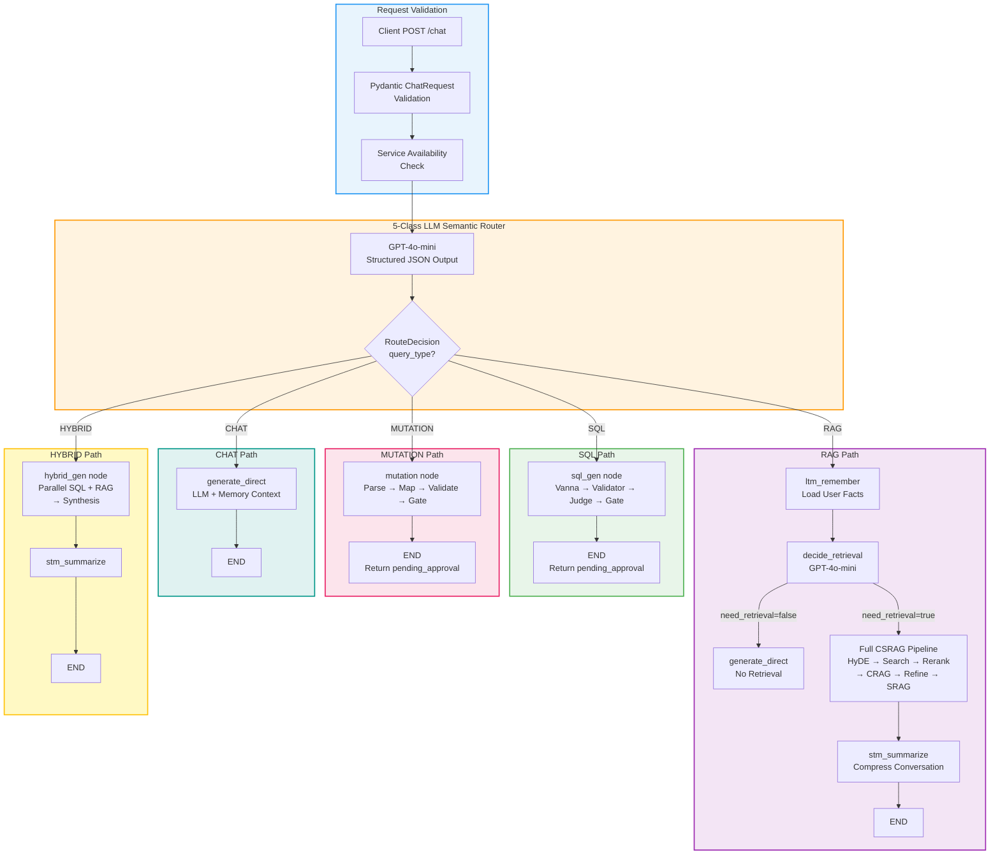
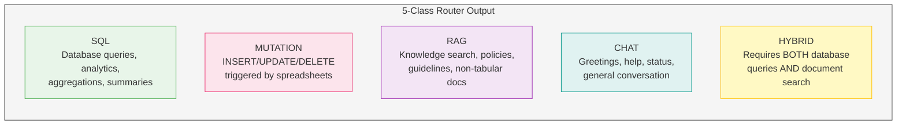

# 02 — Unified Query Flow

**Project:** Intelligent Data Operations Platform (IDOP)
**Version:** 0.1.1
**Last Updated:** 2026-06-15

---

## Overview

Every user interaction with IDOP enters through a single `/chat` endpoint and is classified by a **5-class LLM semantic router** into one of five processing paths: **SQL**, **MUTATION**, **RAG**, **CHAT**, or **HYBRID**. The router uses `GPT-4o-mini` with structured JSON output to perform zero-shot classification, then dispatches execution to the appropriate LangGraph subgraph.

This unified entry point ensures consistent request validation, memory integration, and response formatting regardless of which feature handles the query.

---

## Flow Diagram



---

## Key Components

### Request Validation (`ChatRequest`)

All queries are validated against the `ChatRequest` Pydantic model before reaching the router:

| Field | Type | Constraints | Description |
|---|---|---|---|
| `question` | `str` | `min_length=1`, `max_length=2000` | Natural language query or command |
| `thread_id` | `str` | Required (UUID recommended) | Conversation thread for STM continuity |
| `user_id` | `str` | Required | User identifier for LTM personalization |
| `include_sources` | `bool` | Default: `true` | Include source chunk references in response |
| `search_mode` | `Literal` | `"dense"` / `"sparse"` / `"hybrid"` | Vector search strategy (default: `hybrid`) |
| `top_k` | `int` | `ge=1`, `le=20` (default: `4`) | Number of documents to retrieve |
| `enable_hyde` | `bool` | Default: `false` | Enable HyDE query expansion |
| `enable_reranking` | `bool` | Default: `false` | Enable Voyage AI cross-encoder reranking |

Source: [schemas.py](../../app/api/schemas.py) (lines 141–197)

### Service Availability Check

During FastAPI **lifespan startup**, the following services are initialized in dependency order:

1. **VectorStoreService** — Qdrant client connection + collection verification
2. **AsyncPostgresStore** — LTM fact store connection + schema setup
3. **AsyncPostgresSaver** — STM checkpointer connection + schema setup
4. **CSRAGEngine** — LangGraph graph compilation with store + checkpointer

If any service fails to initialize, the application will not start. The `/health/ready` endpoint performs runtime checks on Qdrant and PostgreSQL connectivity.

### 5-Class LLM Semantic Router

The `QueryRouter` uses the LiteLLM Router (primary: Groq `llama-3.3-70b-versatile`, fallback: OpenAI `gpt-4o-mini`) with `temperature=0.0` and structured JSON output to classify queries:



**Classification examples:**

| User Query | Classification | Reason |
|---|---|---|
| *"How many SMB customers are in Canada?"* | **SQL** | Querying transactional data from `customers` table |
| *"Insert new products from this file"* | **MUTATION** | Spreadsheet-driven data modification |
| *"What is our refund policy?"* | **RAG** | Knowledge retrieval from uploaded documents |
| *"Hello, how does this work?"* | **CHAT** | General conversational greeting |
| *"List products in stock and verify pricing policy compliance"* | **HYBRID** | Requires both SQL data + document guidelines |

**Fallback behavior:** If the router call fails (network error, parsing failure), the system defaults to `CHAT` — the safest fallback that cannot modify data.

> **Note on LLM architecture:** All classification (routing, decide_retrieval, CRAG, SRAG support/usefulness) uses `get_chat_llm()` or `get_memory_llm()`, both of which default to the LiteLLM Router with Groq `llama-3.3-70b-versatile`. OpenAI `gpt-4o-mini` serves only as a fallback when all Groq keys are exhausted. SQL generation uses Vanna 2.0's internal `OpenAILlmService` with `gpt-4o-mini`, with a fallback to direct LiteLLM SQL generation.

Source: [router.py](../../app/core/graph/router.py)

---

## The Five Processing Paths

### Path 1: SQL → `sql_gen` → END

```
router → sql_gen → END
```

- **Vanna 2.0** (via `OpenAILlmService` with `gpt-4o-mini`) generates SQL from natural language; falls back to direct LiteLLM SQL generation
- **SQLValidator** checks for forbidden commands (DROP, TRUNCATE, ALTER, INSERT, UPDATE, DELETE, etc.)
- **LLMJudge** (via `get_memory_llm()` — defaults to `llama-3.3-70b-versatile`) performs semantic audit of join correctness and filter accuracy
- **ApprovalGate** generates a cryptographic token (`secrets.token_hex(32)`)
- Returns `status: "pending_approval"` with `approval_token`
- User must call `/sql/approve` with the token to execute

### Path 2: MUTATION → `mutation` → END

```
router → mutation → END
```

- Graph node sets `mutation_status: "pending_approval"`
- Actual file processing happens at the `/mutation/upload` FastAPI route level
- **FileParser** → **OpClassifier** → **ColumnMapper** → **RuleValidator** → **MutationGenerator** → **MutationLLMJudge** → **MutationApprovalGate**
- User must call `/mutation/approve` with the token to execute

### Path 3: RAG → `ltm_remember` → `decide_retrieval` → CSRAG → `stm_summarize` → END

```
router → ltm_remember → decide_retrieval
    ├── need_retrieval=false → generate_direct → END
    └── need_retrieval=true  → retrieve_docs → evaluate_docs
        ├── CORRECT    → refine_context → generate_answer → verify_support
        └── INCORRECT  → rewrite_query → web_search → refine_context → ...
            → verify_support
                ├── fully_supported → verify_usefulness
                └── not fully_supported → revise_answer (max 2 retries) → ...
                    → verify_usefulness
                        ├── useful → stm_summarize → END
                        └── not_useful → rewrite_question (max 2 tries) → retrieve_docs → ...
```

### Path 4: CHAT → `generate_direct` → END

```
router → generate_direct → END
```

- Bypasses retrieval entirely
- Uses `GPT-4o` with system prompt that includes LTM context and STM summary
- Handles greetings, help questions, system status inquiries

### Path 5: HYBRID → `hybrid_gen` → `stm_summarize` → END

```
router → hybrid_gen → stm_summarize → END
```

- **Parallel execution:** SQL generation + RAG retrieval run concurrently
- SQL path: Vanna → Validator → Judge → Direct SELECT execution (read-only, no approval gate)
- RAG path: HyDE (optional) → Hybrid search → Reranking (optional) → CRAG → Sentence refinement
- **Synthesis:** GPT-4o merges database results and document context into a unified business report
- Only `SELECT` queries execute automatically in hybrid mode — non-SELECT queries are skipped with a safety error

---

## Data Flow

```
POST /chat { question, thread_id, user_id, search_mode, top_k, ... }
    │
    ▼
Pydantic ChatRequest validation (1-2000 chars, required IDs)
    │
    ▼
CSRAGEngine.aquery(question, thread_id, user_id, ...)
    │
    ▼
LangGraph StateGraph.ainvoke(initial_state, config)
    │  config = { thread_id, user_id, recursion_limit: 80 }
    │
    ▼
router_node → GPT-4o-mini classifies → { query_type: "SQL"|"MUTATION"|"RAG"|"CHAT"|"HYBRID" }
    │
    ├── SQL      → sql_gen → END → { sql_query, sql_query_id, approval_token, status }
    ├── MUTATION → mutation → END → { mutation_status, mutation_error }
    ├── RAG      → ltm_remember → decide_retrieval → [CSRAG pipeline] → stm_summarize → END
    ├── CHAT     → generate_direct → END → { answer }
    └── HYBRID   → hybrid_gen → stm_summarize → END → { answer, sql_query, sql_results }
    │
    ▼
CSRAGEngine._format_result(state) → ChatResponse
    │
    ▼
JSON Response → Client
```

---

## Response Schema

The unified `ChatResponse` model returns:

| Field | Type | Present For |
|---|---|---|
| `answer` | `str` | All paths |
| `sources` | `list[SourceDocument]` | RAG, HYBRID |
| `processing_time_ms` | `float` | All paths |
| `crag_verdict` | `str` | RAG, HYBRID |
| `issup` | `str` | RAG (fully_supported / partially_supported / no_support / skipped) |
| `isuse` | `str` | RAG (useful / not_useful) |
| `retries` | `int` | RAG (SRAG revision count) |
| `rewrite_tries` | `int` | RAG (question rewrite count) |
| `sql_query` | `str` | SQL, HYBRID |
| `sql_results` | `list[dict]` | HYBRID (auto-executed SELECTs only) |
| `hyde_used` | `bool` | RAG, HYBRID |
| `reranking_used` | `bool` | RAG, HYBRID |
| `approval_token` | `str` | SQL (pending approval) |

---

## Performance Characteristics

| Path | Typical Latency | LLM Calls | Notes |
|---|---|---|---|
| **CHAT** | 200–600 ms | 1 (router) + 1 (generate) | Fastest path — no retrieval |
| **SQL** | 1–3 s | 1 (router) + 1 (Vanna) + 1 (Judge) | Blocks at approval gate |
| **MUTATION** | <500 ms | 1 (router via `get_chat_llm()`) | Graph node only sets state; processing at route level |
| **RAG** (no retrieval) | 400–800 ms | 1 (router) + 1 (decide) + 1 (generate) | LTM context included |
| **RAG** (full CSRAG) | 3–8 s | 1 (router) + 1 (decide) + 1–3 (HyDE) + 1 (CRAG) + 1 (refine) + 1 (generate) + 1 (SRAG support) + 1 (SRAG useful) | Worst case with retries: +2–4 s |
| **HYBRID** | 5–12 s | Router + SQL chain + RAG chain + synthesis | Most expensive path |

---

## Related Workflows

- [01 — System Architecture](./01-system-architecture.md) — Complete component map
- [03 — Document Upload Pipeline](./03-document-upload-pipeline.md) — How documents enter the vector store
- [04 — NL-to-SQL Execution](./04-feature1-sql-execution.md) — SQL path deep dive
- [05 — Mutation Pipeline](./05-feature2-mutation-pipeline.md) — Mutation path deep dive
- [06 — RAG Pipeline](./06-feature3-rag-pipeline.md) — RAG path deep dive
- [07 — LangGraph State Machine](./07-langgraph-state-machine.md) — Complete graph definition
