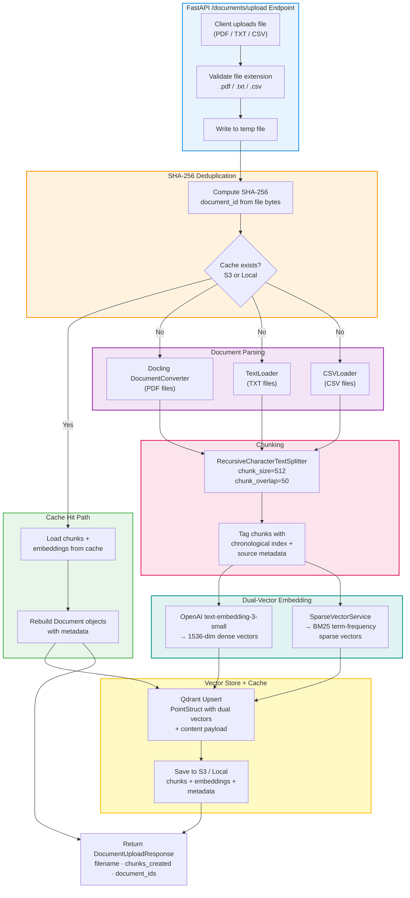

# 03 — Document Upload Pipeline

**Project:** Intelligent Data Operations Platform (IDOP)
**Version:** 0.1.0
**Last Updated:** 2026-05-25

---

## Overview

The document upload pipeline ingests knowledge-base files (PDF, TXT, CSV) into IDOP's vector store for RAG retrieval. The pipeline implements a **cache-first** strategy using SHA-256 content hashing: if a document has been previously processed, its cached chunks and embeddings are loaded directly into Qdrant without re-parsing or re-embedding.

Every document passes through: **SHA-256 dedup check** → **parsing** → **chunking** → **dense embedding** → **sparse vector generation** → **dual-vector Qdrant upsert** → **cache persistence** (S3 or local storage).

---

## Flow Diagram



---

## Key Components

### File Upload Endpoint

- **Route:** `POST /documents/upload`
- **Accepts:** Multipart file upload
- **Supported extensions:** `.pdf`, `.txt`, `.csv`
- Unsupported extensions return `400 Bad Request` with supported format list
- Source: [documents.py](../../app/api/routes/documents.py)

### SHA-256 Document Deduplication

The `CacheService.compute_document_id()` method generates a deterministic content hash:

```python
sha256 = hashlib.sha256()
with open(file_path, "rb") as f:
    for chunk in iter(lambda: f.read(8192), b""):
        sha256.update(chunk)
doc_id = sha256.hexdigest()
```

- **Identical files** always produce the same `document_id`, regardless of filename
- **Cache check** queries S3/local storage for existing `{doc_id}.{ext}` artifacts
- If cached: skip parsing + embedding entirely, load pre-computed chunks
- Source: [cache_service.py](../../app/services/cache_service.py) (lines 48–59)

### Document Parsing (`DocumentProcessor`)

| File Type | Parser | Output |
|---|---|---|
| `.pdf` | **Docling** `DocumentConverter` | One `Document` with structured markdown output |
| `.txt` | `TextLoader` (UTF-8) | Single `Document` per file |
| `.csv` | `CSVLoader` (UTF-8) | One `Document` per row |

> **Note:** PDFs are parsed using IBM's [Docling](https://github.com/docling-project/docling) AI document understanding library (`DocumentConverter`), which preserves document structure (headings, tables, lists) and exports to markdown. This replaces the older `PyPDFLoader` for superior layout handling and OCR support on scanned documents.

- Files are written to a temporary path before parsing
- Temporary files are cleaned up (`unlink`) in a `finally` block
- Each document's `metadata.source` is set to the original upload filename
- Source: [document_processor.py](../../app/core/document_processor.py) (lines 38–88)

### Text Chunking

The `RecursiveCharacterTextSplitter` divides documents into manageable chunks:

| Parameter | Value | Purpose |
|---|---|---|
| `chunk_size` | 512 | Maximum characters per chunk |
| `chunk_overlap` | 50 | Overlapping characters between adjacent chunks |
| `separators` | `["\n\n", "\n", ". ", " ", ""]` | Split hierarchy from paragraph to character level |

**Index tagging** for Context Enrichment:

```python
for idx, chunk in enumerate(chunks):
    chunk.metadata["index"] = idx       # chronological position
    chunk.metadata["source"] = filename  # parent document
```

This index metadata enables the **Context Enrichment Service** to fetch neighboring chunks by `(source, index ± 1)` during retrieval, expanding the context window around relevant hits.

Source: [document_processor.py](../../app/core/document_processor.py) (lines 90–102)

### Dense Embedding Generation

- **Model:** OpenAI `text-embedding-3-small`
- **Dimensions:** 1536
- **Method:** `OpenAIEmbeddings.embed_documents(texts)` — batch embedding of all chunk texts
- Returns one 1536-dimensional float vector per chunk
- Source: [embeddings.py](../../app/core/embeddings.py)

### Sparse Vector Generation (`SparseVectorService`)

The BM25-style sparse vector generator:

1. **Tokenize** — lowercase, regex extract `[a-z0-9]+` tokens, remove stop words
2. **Hash** — deterministic `abs(hash(token)) % (2^32)` mapping to sparse indices
3. **Count** — term frequency as float values

```python
SparseVector(indices=[...], values=[...])  # Qdrant-native format
```

- No external model dependency — runs entirely in-process
- Produces variable-length sparse vectors proportional to unique terms
- Source: [sparse_vector_service.py](../../app/core/sparse_vector_service.py)

### Qdrant Dual-Vector Upsert

Each chunk is stored as a `PointStruct` with two named vector spaces:

```python
PointStruct(
    id=chunk_uuid,           # UUID4 string
    vector={
        "dense": [0.012, ...],    # 1536-dim float list
        "sparse": SparseVector(   # BM25 indices + values
            indices=[...],
            values=[...]
        )
    },
    payload={
        "content": "chunk text...",
        "source": "filename.pdf",
        "index": 0,               # chronological position
        "page": 1,                # PDF page number (if applicable)
    }
)
```

- **Collection:** `idop_documents` (configurable via `COLLECTION_NAME` env var)
- **Dense config:** `VectorParams(size=1536, distance=Distance.COSINE)`
- **Sparse config:** `SparseVectorParams()` (default BM25 settings)
- Source: [vector_store.py](../../app/core/vector_store.py) (lines 72–114)

### Cache Persistence

After successful Qdrant upsert, chunks and embeddings are cached:

| Artifact | Format | Storage |
|---|---|---|
| Chunks | JSON list of `{content, metadata}` | S3 or local filesystem |
| Embeddings | NumPy `.npy` array (float32) | S3 or local filesystem |
| Metadata | JSON dict (filename, chunk_count, timestamp) | S3 or local filesystem |

**Storage backend selection:**

| Environment | Backend | Configuration |
|---|---|---|
| Production | S3 | `storage_backend=s3`, bucket: `idop-cache-docs` |
| Development | Local | `storage_backend=local`, dir: `data/cached_chunks` |
| S3 failure (non-prod) | Local fallback | Automatic downgrade with warning log |
| S3 failure (production) | **Error** | Raises `RuntimeError` — cache is required in prod |

Source: [cache_service.py](../../app/services/cache_service.py) (lines 76–104)

---

## Data Flow

```
Client uploads file.pdf
    │
    ▼
FastAPI validates extension (.pdf ✓)
    │
    ▼
Write to temp file → compute SHA-256 → doc_id = "a1b2c3..."
    │
    ▼
Check cache: S3/local for doc_id
    │
    ├── CACHE HIT:
    │   Load chunks[] + embeddings[] + metadata{}
    │   Rebuild Document objects
    │   Upsert to Qdrant (dual vectors from cache)
    │   Return response (fast path)
    │
    └── CACHE MISS:
        Parse with Docling DocumentConverter → Document (structured markdown)
        │
        ▼
        Split with RecursiveCharacterTextSplitter
        → chunks[] (512 chars, 50 overlap)
        Tag each chunk with index + source
        │
        ▼
        Dense: OpenAI text-embedding-3-small → 1536-dim vectors[]
        Sparse: SparseVectorService → BM25 SparseVector[]
        │
        ▼
        Upsert PointStruct[] to Qdrant
        (dense + sparse + content payload)
        │
        ▼
        Save to S3/local cache
        (chunks.json + embeddings.npy + metadata.json)
        │
        ▼
        Return DocumentUploadResponse
```

---

## Performance Characteristics

| Operation | Typical Duration | Notes |
|---|---|---|
| **SHA-256 hash** (10 MB file) | ~20 ms | Streamed in 8 KB blocks |
| **Cache hit** (load + upsert) | ~200–500 ms | Skips parsing + embedding entirely |
| **PDF parsing** (50 pages) | ~3–10 s | Docling DocumentConverter with layout analysis |
| **Chunking** (500 chunks) | ~50 ms | In-memory text splitting |
| **Dense embedding** (500 chunks) | ~3–8 s | OpenAI API batch call (rate-limited) |
| **Sparse vectors** (500 chunks) | ~100 ms | In-process tokenization + hashing |
| **Qdrant upsert** (500 points) | ~200–500 ms | Batch upsert with dual vectors |
| **Cache save** (S3) | ~300–800 ms | Chunks JSON + embeddings NumPy + metadata |
| **Cache save** (local) | ~50–100 ms | Filesystem write |
| **Total (cache miss, 50-page PDF)** | ~5–12 s | End-to-end including all API calls |
| **Total (cache hit)** | ~200–500 ms | 10–50× faster than cache miss |

---

## Error Handling

| Error | Response | Recovery |
|---|---|---|
| Unsupported file extension | `400 Bad Request` | Client retries with supported format |
| PDF parsing failure | `500 Internal Server Error` | Error logged, temp file cleaned up |
| OpenAI embedding API error | Exception propagated | Temp file cleaned up in `finally` block |
| Qdrant upsert failure | Exception propagated | Partial cache not saved (transactional) |
| S3 cache save failure | Warning logged | Document is indexed but not cached for next time |
| Cache corruption on load | Returns `None` | Falls through to full re-processing |

---

## Related Workflows

- [01 — System Architecture](./01-system-architecture.md) — Storage backends and Qdrant configuration
- [02 — Unified Query Flow](./02-unified-query-flow.md) — How uploaded documents are queried
- [06 — RAG Pipeline](./06-feature3-rag-pipeline.md) — How chunks are retrieved and evaluated
- [07 — LangGraph State Machine](./07-langgraph-state-machine.md) — Graph node definitions
