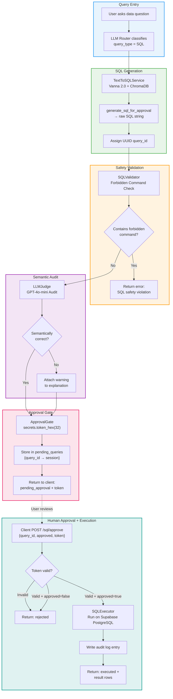

# 04 — Feature 1: NL-to-SQL Execution

**Project:** Intelligent Data Operations Platform (IDOP)
**Version:** 0.1.0
**Last Updated:** 2026-06-12

---

## Overview

Feature 1 translates natural language questions into validated SQL queries, executes them on Supabase PostgreSQL after explicit human approval, and logs every operation to an audit trail. The pipeline implements a **four-stage safety chain**: Vanna 2.0 generation → SQLValidator forbidden command check → LLMJudge semantic audit → cryptographic ApprovalGate.

No SQL query is ever executed without passing all four stages. The approval gate uses a 32-byte cryptographic token (`secrets.token_hex(32)`) to prevent replay attacks and unauthorized execution.

---

## Flow Diagram



---

## Key Components

### TextToSQLService (Vanna 2.0)

The primary SQL generation engine, backed by Vanna's ChromaDB-based vectorstore for schema context:

- **Schema training:** Database schema DDL, table relationships, and few-shot examples are indexed in ChromaDB
- **Generation:** `vanna.generate_sql(question)` produces SQL from natural language
- **Query ID:** Each generation is assigned a UUID for session tracking
- **Fallback:** If Vanna fails, falls back to direct GPT-4o SQL generation
- Source: [vanna_service.py](../../app/core/feature1_sql/vanna_service.py)

### SQLValidator

A static rule-based validator that enforces **read-only SELECT-only** policy. Every user query is checked against a forbidden command list and must begin with `SELECT`:

| Forbidden Command | Risk |
|---|---|
| `DROP` | Table/database destruction |
| `TRUNCATE` | Mass data deletion |
| `ALTER` | Schema modification |
| `GRANT` | Privilege escalation |
| `REVOKE` | Privilege removal |
| `CREATE` | Schema creation |
| `REPLACE` | Data overwrite |
| `INSERT` | Data insertion |
| `UPDATE` | Data modification |
| `DELETE` | Data deletion |
| `EXECUTE` / `EXEC` | Arbitrary code execution |
| `COMMIT` | Transaction forcing |
| `ROLLBACK` | Transaction cancellation |

**Validation process:**
1. Normalize SQL to uppercase
2. Word-boundary regex check against forbidden command list (blocks all DDL, DCL, DML except SELECT)
3. Enforce that query must start with `SELECT`
4. Returns `(is_safe: bool, error_message: str)`

> ⚠️ **Only read-only `SELECT` queries are permitted.** All DML commands (`INSERT`, `UPDATE`, `DELETE`) are blocked — mutations go through the separate Feature 2 mutation pipeline with its own approval gate.

Source: [sql_validator.py](../../app/core/feature1_sql/sql_validator.py)

### LLMJudge (Semantic Audit)

A `GPT-4o-mini`-powered semantic evaluator that audits generated SQL for logical correctness:

| Check | What It Verifies |
|---|---|
| **Join correctness** | Are JOIN conditions using the correct foreign keys? |
| **Filter accuracy** | Do WHERE clauses match the user's intent? |
| **Column validity** | Do referenced columns exist in the schema? |
| **Aggregation logic** | Are GROUP BY / HAVING clauses correctly formed? |
| **Intent alignment** | Does the SQL answer the actual question asked? |

**Output:** `(is_correct: bool, explanation: str)`

- If `is_correct=false`, the query still proceeds but with a `⚠️ LLM Judge Warning:` prefix in the explanation
- The warning is surfaced to the user in the approval interface so they can make an informed decision
- Source: [llm_judge.py](../../app/core/feature1_sql/llm_judge.py)

### ApprovalGate (Shared)

A shared, parameterized `ApprovalGate` class provides cryptographic session tokens for **both** SQL (Feature 1) and mutation (Feature 2) pipelines. It eliminates the near-identical duplicate approval gates that existed in each feature module.

The class is instantiated with different table names and session column names for each use case:

```python
# Shared singleton in app/core/approval_gate.py
approval_gate = ApprovalGate(
    table_name="idop_approval_tokens",
    session_column="query_id",
    logger_name="idop_app.approval_gate",
)

mutation_approval_gate = ApprovalGate(
    table_name="idop_mutation_approval_tokens",
    session_column="mutation_id",
    logger_name="idop_app.mutation_approval_gate",
)
```

**Token generation:**
```python
token = secrets.token_hex(32)  # 64-char hex string
```

**Session storage:**
```python
pending_queries[query_id] = {
    "question": "How many customers?",
    "sql": "SELECT COUNT(*) FROM customers;",
    "status": "pending_approval",
    "token": "a1b2c3d4e5f6..."  # 64 chars
}
```

- Tokens are single-use — consumed on first approval/rejection
- Tokens are persisted in PostgreSQL (table: `idop_approval_tokens`) with an in-memory fallback for local/offline testing
- Sessions persist in memory on the EC2 instance (not Lambda, which would lose state)
- Source: [approval_gate.py](../../app/core/approval_gate.py)

### AuditLogger (Shared)

Audit logging logic that was previously duplicated in both `SQLExecutor` and `MutationExecutor` is now consolidated into a single `AuditLogger` class in `app/core/audit_logger.py`. It manages the `idop_audit_logs` table and provides `ensure_table()` and `log()` methods.

```python
# Shared service (app/core/audit_logger.py)
audit = AuditLogger()
audit.ensure_table(conn)                          # CREATE TABLE IF NOT EXISTS
audit.log(conn, query_id, question, sql, status)  # INSERT INTO idop_audit_logs
```

Source: [audit_logger.py](../../app/core/audit_logger.py)

### SQLExecutor

Executes approved SQL queries against Supabase PostgreSQL and logs the results:

- **Connection:** Direct PostgreSQL connection to Supabase
- **Execution:** Parameterized query execution
- **Audit logging:** Uses the shared `AuditLogger` to record `query_id`, `question`, `sql`, `status`, `timestamp`
- **Error handling:** Database errors are caught and returned as structured error responses
- Source: [executor.py](../../app/core/feature1_sql/executor.py)

---

## Graph Node Implementation

The `sql_generation_node` in LangGraph orchestrates the full pipeline:

```python
async def sql_generation_node(state: CSRAGState) -> dict:
    # 1. Generate SQL via Vanna
    gen_res = await sql_service.generate_sql_for_approval(question)
    
    # 2. Validate against forbidden commands
    is_safe, error_msg = validator.validate(sql)
    if not is_safe:
        return {"sql_status": "error", "sql_explanation": error_msg}
    
    # 3. Run LLM Judge semantic audit
    is_correct, explanation = judge.judge_sql(question, sql)
    if not is_correct:
        explanation = f"⚠️ LLM Judge Warning: {explanation}"
    
    # 4. Generate cryptographic approval token
    token = gate.generate_session(query_id)
    
    # 5. Store pending session in shared pending store
    shared_pending_queries[query_id] = { ... }
    
    return {
        "sql_query": sql,
        "sql_query_id": query_id,
        "sql_status": "pending_approval",
        "sql_explanation": explanation,
        "approval_token": token
    }
```

**Graph edge:** `sql_gen → END` — the pipeline terminates at the approval gate. Execution happens via a separate `/sql/approve` API call.

Source: [nodes.py](../../app/core/graph/nodes.py) (lines 91–141)

> **Note:** An unreachable auto-execute SELECT block (~50 lines) and a duplicate `pending_approval` return block (~25 lines) were removed from `sql_generation_node` — the function always returns `pending_approval`; execution happens via the separate `/sql/approve` API call.

---

## API Endpoints

### Generate SQL

```
POST /sql/generate
Content-Type: application/json

{
    "question": "How many customers are in the SMB segment?",
    "thread_id": "uuid-thread-123",
    "user_id": "user-456"
}
```

**Response (SQLResponse):**
```json
{
    "query_id": "8f8e8b0a-7f6c-5b4a-3a2b-1a0f9e8d7c6b",
    "question": "How many customers are in the SMB segment?",
    "sql": "SELECT COUNT(*) as smb_count FROM customers WHERE segment = 'SMB';",
    "explanation": "Generates a COUNT query filtering customers by segment = 'SMB'.",
    "status": "pending_approval",
    "cache_hit": false
}
```

### Approve and Execute

```
POST /sql/approve
Content-Type: application/json

{
    "query_id": "8f8e8b0a-7f6c-5b4a-3a2b-1a0f9e8d7c6b",
    "approved": true,
    "token": "a1b2c3d4e5f6..."
}
```

**Response (SQLExecuteResponse):**
```json
{
    "query_id": "8f8e8b0a-7f6c-5b4a-3a2b-1a0f9e8d7c6b",
    "sql": "SELECT COUNT(*) as smb_count FROM customers WHERE segment = 'SMB';",
    "results": [{"smb_count": 42}],
    "result_count": 1,
    "status": "executed",
    "cache_hit": false
}
```

---

## Data Flow

```
User: "How many customers are in Canada?"
    │
    ▼
Router → query_type = "SQL"
    │
    ▼
sql_gen node:
    ├── Vanna 2.0 → "SELECT COUNT(*) FROM customers WHERE country = 'Canada';"
    ├── SQLValidator → ✓ No forbidden commands
    ├── LLMJudge → ✓ Correct join/filter/column usage
    └── ApprovalGate → token = "a1b2c3..." (64 chars)
    │
    ▼
Response: { status: "pending_approval", sql, query_id, token }
    │
    ▼
User reviews SQL → POST /sql/approve { query_id, approved: true, token }
    │
    ▼
Token validation ✓ → SQLExecutor runs on Supabase
    │
    ▼
Audit log entry written
    │
    ▼
Response: { status: "executed", results: [{count: 87}] }
```

---

## Caching Strategy

The SQL pipeline uses **two Redis cache tiers**:

| Cache Tier | Key Format | TTL | Purpose |
|---|---|---|---|
| **SQL generation** | `sql_gen:{sha256(question)}` | 24 hours | Skip Vanna + validation for repeated questions |
| **SQL results** | `sql_result:{sha256(normalized_sql)}` | 15 minutes | Skip re-execution for identical queries |

- SQL generation cache stores the generated SQL string + explanation
- SQL result cache stores the execution result rows
- Cache keys use SHA-256 hashing of the input (question or normalized SQL)
- SQL normalization: lowercase + whitespace collapse before hashing

---

## Performance Characteristics

| Stage | Typical Latency | Notes |
|---|---|---|
| **Vanna SQL generation** | 800–2000 ms | ChromaDB schema lookup + OpenAI generation |
| **SQLValidator** | <1 ms | In-memory regex check |
| **LLMJudge audit** | 300–800 ms | GPT-4o-mini structured output |
| **ApprovalGate token** | <1 ms | `secrets.token_hex(32)` |
| **Total (generation)** | 1–3 s | End-to-end until pending_approval |
| **SQLExecutor** | 50–500 ms | Depends on query complexity and data volume |
| **Audit log write** | 20–50 ms | Single INSERT to Supabase |
| **Cache hit (SQL gen)** | <10 ms | Redis SHA-256 lookup |
| **Cache hit (SQL result)** | <10 ms | Redis normalized SQL lookup |

---

## Security Model

| Layer | Protection |
|---|---|
| **SQLValidator** | Blocks ALL non-SELECT commands — only read-only SELECT queries pass. DML (INSERT, UPDATE, DELETE), DDL, DCL, and EXEC are all forbidden. Mutations use the separate Feature 2 pipeline |
| **LLMJudge** | Detects logical errors in query semantics |
| **ApprovalGate** | Cryptographic token prevents unauthorized execution |
| **Single-use tokens** | Prevents replay attacks |
| **Audit logging** | Full traceability of every executed query |
| **Supabase isolation** | AI infrastructure has no direct DDL access to business database |

---

## Related Workflows

- [01 — System Architecture](./01-system-architecture.md) — Supabase and Redis configuration
- [02 — Unified Query Flow](./02-unified-query-flow.md) — How SQL queries enter the router
- [05 — Mutation Pipeline](./05-feature2-mutation-pipeline.md) — Similar approval gate pattern for mutations
- [07 — LangGraph State Machine](./07-langgraph-state-machine.md) — `sql_gen` node and `route_after_router`
