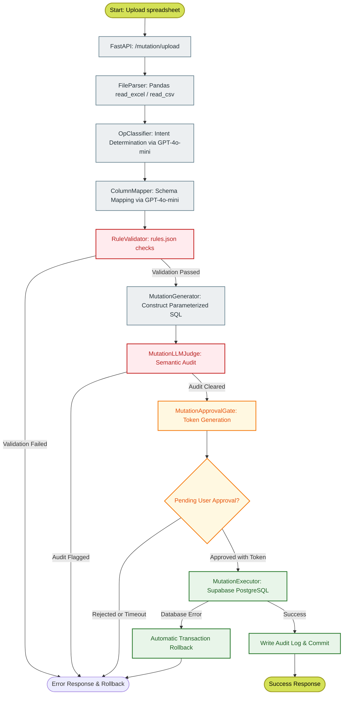

# 05-feature2-mutation-pipeline: Document-Driven Mutations

This workflow describes the step-by-step pipeline for executing safe, controlled, and audit-logged database mutations derived from uploaded spreadsheet files (Excel/CSV) under the IDOP governance framework.

---

## Overview

Enterprise operations frequently require updating database states based on spreadsheets supplied by external vendors or internal analysts. Allowing raw or direct file mutations to database tables introduces substantial risks of data corruption, schema mismatches, and compliance violations.

IDOP addresses this by introducing a strict, step-by-step **Document-Driven Mutation Pipeline**. Rather than executing arbitrary updates, the system processes files through a multi-layered guardrail sequence, requiring explicit human-in-the-loop cryptographic approval before any transaction is committed.



---

## Key Components

The mutation pipeline relies on seven specialized architectural layers:

*   **FileParser (`app/core/feature2_mutation/file_parser.py`)**: Accepts Excel (`.xlsx`, `.xls`) or CSV uploads and parses them safely into high-performance `pandas` DataFrames, filtering out empty rows, bad encodings, and malicious macros.
*   **OpClassifier (`app/core/feature2_mutation/op_classifier.py`)**: Uses a structured `GPT-4o-mini` call to evaluate the spreadsheet structure, sheet name, and user instruction to classify the overall operation type into exactly `INSERT`, `UPDATE`, or `DELETE`.
*   **ColumnMapper (`app/core/feature2_mutation/column_mapper.py`)**: Uses LLM-driven schema matching to dynamically align spreadsheet headers with database column names, outputting a precise JSON dictionary mapping user columns to physical database columns.
*   **RuleValidator (`app/core/feature2_mutation/rule_validator.py`)**: Executes programmatic type, range, regex, and integrity checks against the validation dictionary specified in `business_rules/rules.json`.
*   **MutationGenerator (`app/core/feature2_mutation/mutation_generator.py`)**: Translates the mapped and validated rows into standard parameterized PostgreSQL mutation queries, keeping data parameterized to prevent SQL injection.
*   **MutationLLMJudge (`app/core/feature2_mutation/llm_judge.py`)**: Audits draft queries for logical validation (e.g. massive deletion scope or out-of-bounds update ranges).
*   **MutationApprovalGate**: Uses the shared [ApprovalGate](../../app/core/approval_gate.py) class (instantiated as `mutation_approval_gate`), providing a single-use cryptographically secure hex token (`secrets.token_hex(32)`) and stores the pending transaction payload until the user signs off. The original `app/core/feature2_mutation/approval_gate.py` is now a thin re-export of the shared singleton.

---

## Data Flow & Processing Stages

### 1. Ingestion and Intent Determination
The user uploads an Excel sheet via the `/mutation/upload` endpoint. The `FileParser` extracts raw data, and `OpClassifier` determines the intent:

> [!NOTE]
> The classification logic ensures that if a spreadsheet contains columns like `ID` and values to be changed, it maps to `UPDATE`. If columns contain strictly new data without primary keys, it maps to `INSERT`.

### 2. Schema Alignment and Mapping
The `ColumnMapper` reconciles varying column naming conventions (e.g., matching "phone_number", "Ph No", and "telephone" to the database column `phone`). It leverages GPT-4o-mini to output a structured JSON schema mapping:

```json
{
  "spreadsheet_column": "Ph No",
  "database_column": "phone",
  "data_type": "VARCHAR"
}
```

### 3. Business Rule Validation (`rules.json`)
Before any query is generated, every single row is validated. The `RuleValidator` references a declarative JSON file (`business_rules/rules.json`) that specifies constraints:

| Column | Rules / Constraints | Actions on Mismatch |
| :--- | :--- | :--- |
| **salary** | Numeric, Min: 0, Max: 10,000,000 | Reject operation |
| **email** | Regex pattern matching `^[a-zA-Z0-9+_.-]+@[a-zA-Z0-9.-]+$` | Flag and skip row or reject |
| **department** | Enum values: `['HR', 'Engineering', 'Sales', 'Finance']` | Reject operation |
| **bulk_limits** | Max bulk rows permitted = 1000 | Enforce hard limit exception |

```json
{
  "employees": {
    "salary": {
      "type": "numeric",
      "min": 0,
      "max": 10000000
    },
    "email": {
      "type": "string",
      "regex": "^[a-zA-Z0-9+_.-]+@[a-zA-Z0-9.-]+$"
    },
    "department": {
      "type": "enum",
      "allowed": ["HR", "Engineering", "Sales", "Finance"]
    }
  }
}
```

### 4. Semantic Audit and Cryptographic Gate
If rule validation succeeds, the `MutationGenerator` drafts SQL mutations. The draft queries are audited by a semantic judge (`MutationLLMJudge`), checking for:
1. Massive deletion scope (e.g., `DELETE` without a matching `WHERE` constraint).
2. Out-of-bounds update ranges.

Once cleared, a session token is generated.

> [!WARNING]
> Transactions are **NEVER** executed automatically. The FastAPI server returns a pending status alongside an approval token. The operation is kept in a thread-safe cache for up to 30 minutes, awaiting confirmation at `POST /mutation/approve` with the token.

### 5. Execution and Automatic Rollback
When the user submits the correct cryptographic token, the `MutationExecutor` runs the transaction inside an isolated block on the Supabase PostgreSQL database. Audit logging uses the shared [AuditLogger](../../app/core/audit_logger.py) class (consolidated from duplicate code in both `SQLExecutor` and `MutationExecutor`):

```python
from app.core.audit_logger import AuditLogger

audit = AuditLogger()
# ... inside the execution block:
audit.ensure_table(conn)
audit.log(conn, mutation_id, question, sql, "SUCCESS")
```

**Transaction flow:**
```python
# app/core/feature2_mutation/executor.py
conn = psycopg2.connect(...)
audit.ensure_table(conn)  # DDL commits on its own
conn.autocommit = False

try:
    # Execute parameterized SQL
    with conn.cursor() as cur:
        cur.execute(sql, params)
    
    audit.log(conn, mutation_id, question, sql, "SUCCESS")
    conn.commit()
except Exception as e:
    conn.rollback()
    audit.log(conn, mutation_id, question, sql, f"FAILED: {e}")
    conn.commit()
finally:
    conn.close()
```

---

## Related Workflows

*   [01-system-architecture](./01-system-architecture.md) - The high-level component map.
*   [04-feature1-sql-execution](./04-feature1-sql-execution.md) - Learn how read-only NL-to-SQL is isolated.
*   [07-langgraph-state-machine](./07-langgraph-state-machine.md) - Details of the mutation state node.
*   [11-memory-system](./11-memory-system.md) - Short and long term user interaction tracking.
