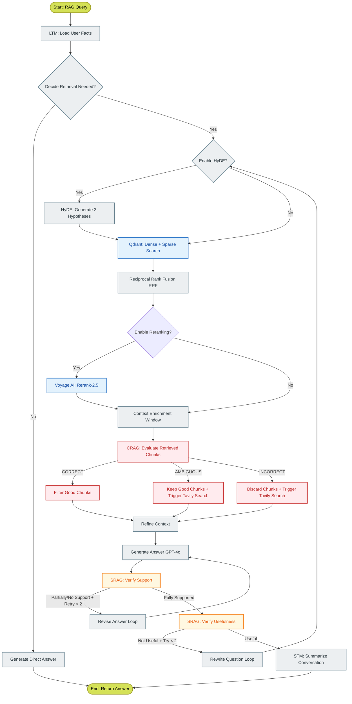

# 06-feature3-rag-pipeline: Advanced CSRAG Pipeline

This document describes the design, execution flow, and self-corrective feedback loops of the IDOP **Corrective-Self-Reflective Retrieval-Augmented Generation (CSRAG)** pipeline.

---

## Overview

Traditional RAG suffers from severe limitations: retrieving outdated or irrelevant documents, hallucinating unsupported facts, and being unable to handle queries that fall outside its vector store.

IDOP introduces a unified **CSRAG Engine** which combines **Corrective RAG (CRAG)** and **Self-Reflective RAG (SRAG)** into a single high-performance pipeline. The pipeline dynamically evaluates retrieved facts, triggers external web searches as a fallback, and enforces multi-stage self-reflection validation loops to guarantee that every answer is factually correct, useful, and fully grounded in evidence.

---

## Detailed Data Flow Stages

### 1. Pre-Retrieval (LTM & Decider)
*   **LTM Memory Injection**: The user's query is augmented with long-term background facts (loaded via `ltm_remember` node).
*   **Decide Retrieval**: GPT-4o-mini checks if the question actually requires vector database lookups (e.g., "Hi, how are you?" goes straight to direct generation, whereas "What is our company's refund policy?" triggers retrieval).

### 2. Hypothetical Document Embeddings (HyDE)
If `enable_hyde=True`, the engine prompts GPT-4o to generate three hypothetical documents containing answers to the user's question. These hypothetical answers are embedded and used as vectors to search the database. This bridges semantic gaps between questions and actual repository texts.

### 3. Dual-Vector Hybrid Retrieval & Fusion
The system queries Qdrant using both dense vectors (text-embedding-3-small) and sparse vectors (BM25 token vectors):
*   **Reciprocal Rank Fusion (RRF)**: Combines the rank scores from both dense and sparse retrieval using a constant $k=60$.
*   **Reranking**: Voyage AI `rerank-2.5` reranks the fused results to place the most precise chunks at the top of the pile.
*   **Context Enrichment**: Neighbor chunk windowing pulls the surrounding sentences (chunk indices $i-1$ and $i+1$) to ensure complete context.

### 4. Corrective RAG (CRAG) Guardrails
The retrieved chunks undergo evaluation by a strict judge (`CRAGEvaluator` using GPT-4o-mini), resulting in one of three evaluation branches:

> [!IMPORTANT]
> **Branch 1: CORRECT (Avg Score > 0.7)**
> The chunks are relevant. The system applies **Sentence-Level Refinement**, dropping irrelevant sentences and building the generation prompt.
>
> **Branch 2: AMBIGUOUS (0.3 <= Avg Score <= 0.7)**
> The chunks are moderately relevant. The system keeps the retrieved chunks AND runs a Tavily Web Search to augment the context with live web data.
>
> **Branch 3: INCORRECT (Avg Score < 0.3)**
> The retrieved chunks are irrelevant. They are entirely discarded, and a Tavily Web Search is triggered to fetch the actual context from the web.

### 5. Self-Reflective RAG (SRAG) Evaluation Loops
Once an answer is drafted, it is subjected to a two-tier self-reflective feedback loop:

#### Stage 5A: Support Verification (NLI check)
*   **Prompt**: The SRAG Verifier evaluates the drafted answer against the refined context and classifies the grounding into `fully_supported`, `partially_supported`, or `no_support`.
*   **Action**: If the answer is `partially_supported` or `no_support`, the engine routes the state back to `revise_answer` node, which instructs GPT-4o to re-synthesize the answer strictly on the provided evidence. This loop is attempted up to 2 times.

#### Stage 5B: Usefulness Verification
*   **Prompt**: Evaluates whether the generated answer directly and effectively answers the user's specific prompt, outputting `useful` or `not_useful`.
*   **Action**: If classified as `not_useful`, the query is reformulated (e.g., stripping noise or adding keywords) via `rewrite_question` node, and the engine triggers a fresh retrieval loop. This is attempted up to 2 times.

---

## Configurable RAG Parameters

The entire engine is dynamically configurable per-request via the `ChatRequest` schema:

| Param Name | Type | Default | Description |
| :--- | :--- | :--- | :--- |
| **search_mode** | `Literal['dense', 'sparse', 'hybrid']` | `'hybrid'` | Specifies which vector search method to use in Qdrant |
| **top_k** | `int` | `4` | Number of document chunks to retrieve (range: 1–20) |
| **enable_hyde** | `bool` | `False` | Toggles Hypothetical Document Embeddings generation |
| **enable_reranking** | `bool` | `False` | Toggles Voyage AI Rerank-2.5 step |

---

## Related Workflows

*   [03-document-upload-pipeline](./03-document-upload-pipeline.md) - The ingestion flow supplying these vectors.
*   [08-hybrid-search](./08-hybrid-search.md) - Detailed breakdown of the Qdrant retrieval layer.
*   [09-crag-pipeline](./09-crag-pipeline.md) - Step-by-step logic of corrective web lookups.
*   [10-srag-pipeline](./10-srag-pipeline.md) - Formal rules for answer verification.
