# 07-langgraph-state-machine: State Machine Graph

This document details the complete structure, state shape, nodes, and conditional routing edges of the IDOP **LangGraph State Machine** governing the query execution engine.

---

## Overview

The core execution engine of IDOP is built as a highly structured, stateful multi-agent system using **LangGraph**. The system represents queries and tasks as transitions through a directed graph (with loops for self-correction).

The state machine is compiled using PostgreSQL-backed checkpointers for Short-Term Memory (STM) and PostgreSQL-backed stores for Long-Term Memory (LTM), allowing conversational sessions to survive service restarts and scale dynamically inside a multi-instance Docker environment.

---

## The CSRAGState Shape

The complete execution context is stored within the thread-safe `CSRAGState` TypedDict. Every node in the graph reads from and writes to this state.

```python
# app/core/graph/state.py
from typing import List, Dict, Any, Literal, TypedDict
from langchain_core.messages import BaseMessage

class CSRAGState(TypedDict):
    # Core Fields
    messages: List[BaseMessage]
    summary: str
    user_id: str
    thread_id: str
    question: str
    
    # Routing Decisions
    query_type: Literal['SQL', 'MUTATION', 'RAG', 'CHAT', 'HYBRID']
    need_retrieval: bool
    
    # Advanced RAG Configurations
    search_mode: Literal['dense', 'sparse', 'hybrid']
    top_k: int
    enable_hyde: bool
    enable_reranking: bool
    
    # HyDE Outputs
    hyde_used: bool
    hyde_hypotheses: List[str]
    
    # RAG Chunks and Refinement
    retrieval_query: str
    docs: List[Dict[str, Any]]
    good_docs: List[Dict[str, Any]]
    crag_verdict: Literal['CORRECT', 'AMBIGUOUS', 'INCORRECT']
    crag_reason: str
    
    # Tavily Web Search Chunks
    web_query: str
    web_docs: List[Dict[str, Any]]
    
    # Context Refinement / Sentence Filtering
    strips: List[str]
    kept_strips: List[str]
    refined_context: str
    
    # Output and Evaluation
    answer: str
    reranking_used: bool
    
    # SRAG Support & Correctness
    issup: Literal['fully_supported', 'partially_supported', 'no_support']
    evidence: str
    retries: int
    
    # SRAG Usefulness & Question Refinement
    isuse: Literal['useful', 'not_useful']
    use_reason: str
    rewrite_tries: int
    
    # SQL Execution Pipeline
    sql_query: str
    sql_results: List[Dict[str, Any]]
    sql_query_id: str
    sql_explanation: str
    sql_status: Literal['pending', 'approved', 'rejected', 'executed', 'failed']
    
    # Mutation Execution Pipeline
    mutation_id: str
    mutation_table: str
    mutation_op: Literal['INSERT', 'UPDATE', 'DELETE']
    mutation_rows: List[Dict[str, Any]]
    mutation_mapped_rows: List[Dict[str, Any]]
    mutation_status: Literal['pending', 'approved', 'executed', 'failed']
    mutation_error: str
    mutation_result_count: int
    
    # Human-In-The-Loop Approval Gates
    approval_token: str
```

---

## State Graph Visualization

```mermaid
graph TD
    %% Styling Definitions
    classDef router fill:#d1c4e9,stroke:#5e35b1,stroke-width:2px,color:#311b92;
    classDef node fill:#eceff1,stroke:#607d8b,stroke-width:1.5px,color:#263238;
    classDef gate fill:#fff8e1,stroke:#f57f17,stroke-width:2px,color:#e65100;
    classDef endNode fill:#d4e157,stroke:#9e9d24,stroke-width:2px,color:#333;

    Start([Start Interaction]) --> Router[router_node: GPT-4o-mini]
    
    %% Router 5-paths
    Router -->|SQL| SQLGen[sql_gen_node: Vanna 2.0]
    Router -->|MUTATION| MutationNode[mutation_node: File Upload Parser]
    Router -->|CHAT| ChatGen[generate_direct_node]
    Router -->|RAG| LTMMem[ltm_remember_node]
    Router -->|HYBRID| HybridNode[hybrid_generation_node: Parallel SQL + RAG]
    
    %% SQL Path
    SQLGen --> STMSum
    
    %% Mutation Path
    MutationNode --> STMSum
    
    %% Direct Chat Path
    ChatGen --> STMSum[stm_summarize_node]
    
    %% Hybrid Path
    HybridNode --> STMSum
    
    %% CSRAG Core Path
    LTMMem --> DecideRet{Decide Retrieval Needed?}
    DecideRet -->|No| ChatGen
    DecideRet -->|Yes| RetrieveDocs[retrieve_docs_node: Dense+Sparse]
    
    RetrieveDocs --> CRAGEval[evaluate_docs_node: CRAG Evaluator]
    
    CRAGEval -->|CORRECT| Refine[refine_context_node]
    CRAGEval -->|AMBIGUOUS| WebSearch[web_search_node: Tavily API]
    CRAGEval -->|INCORRECT| WebSearch
    
    WebSearch --> Refine
    Refine --> GenAnswer[generate_answer_node: GPT-4o]
    
    %% SRAG Loops
    GenAnswer --> SRAGSupport{verify_support_node}
    SRAGSupport -->|Partially / No Support & Try < 2| ReviseAns[revise_answer_node] --> SRAGSupport
    SRAGSupport -->|Fully Supported| SRAGUse{verify_usefulness_node}
    
    SRAGUse -->|Not Useful & Try < 2| RewriteQ[rewrite_question_node] --> LTMMem
    SRAGUse -->|Useful| STMSum
    
    STMSum --> END

    class Router,DecideRet,SRAGSupport,SRAGUse router;
    class SQLGen,MutationNode,ChatGen,LTMMem,HybridNode,RetrieveDocs,CRAGEval,WebSearch,Refine,GenAnswer,ReviseAns,RewriteQ,STMSum node;
    class END endNode;
```



---

## Active Conditional Routing Functions

The LangGraph compiler directs the execution flow dynamically using five custom conditional edge functions based on the current state:

### 1. `route_after_router`
Classifies the raw input and directs the process to one of the five specific functional entrypoints. Note that the HYBRID path returns `"hybrid"` which is mapped to the registered `"hybrid_gen"` node name via the graph builder's edge configuration:
```python
def route_after_router(state: CSRAGState) -> str:
    """
    Route the query to the appropriate first pipeline node.

    Returns the NEXT graph node name:
    - "sql_gen"        → SQL pipeline (Feature 1)
    - "mutation"       → Mutation pipeline (Feature 2)
    - "ltm_remember"   → RAG pipeline (Feature 3)
    - "hybrid"         → HYBRID pipeline (parallel SQL + RAG)
    - "chat"           → Direct LLM response (no retrieval)
    """
    q_type = state.get("query_type", "CHAT")
    if q_type == "SQL":
        return "sql_gen"
    elif q_type == "MUTATION":
        return "mutation"
    elif q_type == "RAG":
        return "ltm_remember"
    elif q_type == "HYBRID":
        return "hybrid"
    else:
        return "chat"
```

The graph builder maps the router output to actual node names via:
```python
builder.add_conditional_edges(
    "router",
    route_after_router,
    {
        "sql_gen": "sql_gen",
        "mutation": "mutation",
        "ltm_remember": "ltm_remember",
        "hybrid": "hybrid_gen",   # mapped to the wrapped node
        "chat": "generate_direct",
    },
)
```

### 2. `route_after_decide`
Determines if RAG retrieval is required or if LTM memory contains sufficient context:
```python
def route_after_decide(state: CSRAGState) -> str:
    if state.get("need_retrieval", True):
        return "retrieve_docs"
    return "generate_direct"
```

### 3. `route_after_crag`
Decides whether external internet queries are needed to rectify poor database context. Now handles three CRAG verdicts — for AMBIGUOUS docs, it goes directly to web search without an LLM query rewrite round-trip:
```python
def route_after_crag(state: CSRAGState) -> str:
    verdict = state["crag_verdict"]
    if verdict == "CORRECT":
        return "refine_context"
    elif verdict == "AMBIGUOUS":
        # AMBIGUOUS: internal docs partially relevant — go directly to web search
        # to supplement, skipping the query rewrite LLM round-trip.
        return "web_search"
    return "rewrite_query"
```

### 4. `route_after_support`
Triggers generation revision if facts are hallucinated or unsupported by source documents:
```python
def route_after_support(state: CSRAGState) -> str:
    verdict = state.get("issup", "fully_supported")
    retries = state.get("retries", 0)
    if verdict != "fully_supported" and retries < 2:
        return "revise_answer"
    return "verify_usefulness"
```

### 5. `route_after_usefulness`
Forces reformulation of questions and repeats retrieval if the answer is evaluated as unhelpful:
```python
def route_after_usefulness(state: CSRAGState) -> str:
    verdict = state.get("isuse", "useful")
    rewrite_tries = state.get("rewrite_tries", 0)
    if verdict != "useful" and rewrite_tries < 2:
        return "rewrite_question"
    return "stm_summarize"
```

---

## Memory Compilation & Persistence

To compile the graph with persistent STM (Short-Term Session Memory) and LTM (Long-Term User Fact Store), IDOP utilizes asynchronous PostgreSQL backend integrations:

```python
# app/core/graph/builder.py
from langgraph.checkpoint.postgres.aio import AsyncPostgresSaver
from langgraph.store.postgres.aio import AsyncPostgresStore

from app.core.graph.nodes import (
    router_node, sql_generation_node, mutation_node, ltm_remember_node,
    decide_retrieval_node, generate_direct_node, retrieve_docs_node,
    evaluate_docs_node, rewrite_query_node, web_search_node,
    refine_context_node, generate_answer_node, verify_support_node,
    revise_answer_node, verify_usefulness_node, rewrite_question_node,
    stm_summarize_node, hybrid_generation_node,
)

async def compile_idop_graph(conn_string: str, vector_store):
    # Setup Persistent Stores
    store = AsyncPostgresStore.from_conn_string(conn_string)
    checkpointer = AsyncPostgresSaver.from_conn_string(conn_string)

    # Initialize StateGraph
    builder = StateGraph(CSRAGState)

    # Register all 18 nodes
    builder.add_node("router", router_node)
    builder.add_node("sql_gen", sql_generation_node)
    builder.add_node("mutation", mutation_node)
    # hybrid_gen wraps hybrid_generation_node with vector_store injection
    hybrid_with_store = partial(hybrid_generation_node, vector_store=vector_store)
    builder.add_node("hybrid_gen", hybrid_with_store)
    builder.add_node("ltm_remember", ltm_remember_node)
    builder.add_node("decide_retrieval", decide_retrieval_node)
    builder.add_node("generate_direct", generate_direct_node)
    builder.add_node("retrieve_docs", retrieve_docs_node)
    builder.add_node("evaluate_docs", evaluate_docs_node)
    builder.add_node("rewrite_query", rewrite_query_node)
    builder.add_node("web_search", web_search_node)
    builder.add_node("refine_context", refine_context_node)
    builder.add_node("generate_answer", generate_answer_node)
    builder.add_node("verify_support", verify_support_node)
    builder.add_node("revise_answer", revise_answer_node)
    builder.add_node("verify_usefulness", verify_usefulness_node)
    builder.add_node("rewrite_question", rewrite_question_node)
    builder.add_node("stm_summarize", stm_summarize_node)

    # Edges with conditional routing
    builder.add_conditional_edges(
        "router", route_after_router,
        {
            "sql_gen": "sql_gen",
            "mutation": "mutation",
            "ltm_remember": "ltm_remember",
            "hybrid": "hybrid_gen",
            "chat": "generate_direct",
        },
    )
    # ... remaining edges follow the CSRAG flow

    compiled_graph = builder.compile(
        checkpointer=checkpointer,
        store=store
    )
    return compiled_graph
```

> **Note:** The `hybrid_gen` node uses `functools.partial` to inject the `vector_store` dependency at graph compilation time. This avoids creating a new `VectorStoreService` for every invocation.

> **Note:** An unreachable auto-execute SELECT block (~50 lines) and a duplicate `pending_approval` return (~25 lines) were removed from `sql_generation_node` in a refactoring pass. The function always returns `pending_approval` — execution happens via `/sql/approve`.

> [!TIP]
> The recursion limit is set to a high value of **80** in execution scripts to comfortably accommodate dual support-revision and usefulness-rewrite feedback loops without hitting LangGraph's safety limits.

---

## Related Workflows

*   [01-system-architecture](./01-system-architecture.md) — High-level component map, API endpoint list, deployment layout (this doc is the definitive graph reference).
*   [02-unified-query-flow](./02-unified-query-flow.md) — The 5-path router entry routes.
*   [04-feature1-sql-execution](./04-feature1-sql-execution.md) — SQL generation node (`sql_gen`) deep dive — Vanna, validator, LLM judge, approval gate.
*   [05-feature2-mutation-pipeline](./05-feature2-mutation-pipeline.md) — Mutation node deep dive — file parsing, column mapping, business rules.
*   [06-feature3-rag-pipeline](./06-feature3-rag-pipeline.md) — CSRAG pipeline deep dive — HyDE, hybrid search, reranking, CRAG, SRAG.
*   [09-crag-pipeline](./09-crag-pipeline.md) — CRAG scoring details (the `evaluate_docs` node).
*   [10-srag-pipeline](./10-srag-pipeline.md) — SRAG verification loops (`verify_support`, `verify_usefulness`).
*   [11-memory-system](./11-memory-system.md) — LTM store and STM checkpointer mechanics.
*   [13-service-initialization](./13-service-initialization.md) — Graph compilation during FastAPI lifespan hooks.
