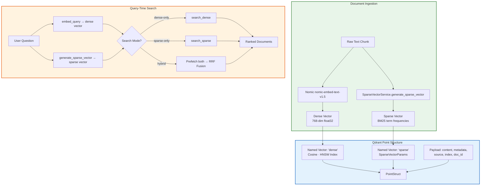

# 08 — Hybrid Search (Dense + Sparse + RRF Fusion)

**Module:** `app/core/vector_store.py` · `app/core/sparse_vector_service.py`
**Qdrant Collection:** `idop_documents`
**Embedding Model:** Nomic `nomic-embed-text-v1.5` (768-dim) or Voyage AI `voyage-3` (1024-dim) — configurable via `EMBEDDING_PROVIDER`

---

## Overview

IDOP uses a **dual-vector hybrid search** architecture within a single Qdrant collection. Every document chunk is indexed with two named vectors — a **dense** semantic embedding and a **sparse** BM25 keyword vector. At query time, the system can run three configurable search modes: dense-only, sparse-only, or hybrid (default). In hybrid mode, Qdrant's native **Reciprocal Rank Fusion (RRF)** merges both ranking lists into a single result set, combining semantic understanding with exact keyword matching.

---

## Architecture Diagram



---

## Key Components

### Qdrant Collection Setup

The collection is created in [VectorStoreService._ensure_collection](file:///c:/Users/manis/Downloads/Agentic-AI/IDOP/app/core/vector_store.py#L46-L70):

- **Collection name:** `idop_documents` (configurable via `settings.collection_name`)
- **Dense vector config:** `VectorParams(size=768, distance=Distance.COSINE)` → named vector `"dense"`
- **Sparse vector config:** `SparseVectorParams()` → named vector `"sparse"`
- **Index type:** HNSW (Qdrant default for dense), inverted index for sparse

### Dense Embeddings

- **Provider:** Configurable via `EMBEDDING_PROVIDER` env var (`nomic` or `voyage`)
- **Nomic:** `nomic-embed-text-v1.5` via `NomicEmbeddings`, 768-dim, Cosine distance
- **Voyage AI:** `voyage-3` via `VoyageAIEmbeddings`, 1024-dim, Cosine distance
- **Source:** [app/core/embeddings.py](file:///c:/Users/manis/Downloads/Agentic-AI/IDOP/app/core/embeddings.py)

### Sparse Vectors (BM25)

Generated by [SparseVectorService](file:///c:/Users/manis/Downloads/Agentic-AI/IDOP/app/core/sparse_vector_service.py):

1. **Tokenization:** Lowercase → regex `\b[a-z0-9]+(?:-[a-z0-9]+)*\b` → stop-word removal (58 common English words)
2. **Hashing:** Each token → `abs(hash(token)) % 2^32` → integer index
3. **Weighting:** Raw term frequency counts as float values
4. **Output:** `SparseVector(indices=[...], values=[...])` — Qdrant's native sparse format

### Qdrant Point Structure

Each indexed chunk is stored as a `PointStruct`:

```python
PointStruct(
    id="uuid4-string",
    vector={
        "dense": [0.012, -0.034, ...],   # 768 floats
        "sparse": SparseVector(
            indices=[42981, 18823, ...],  # hashed token IDs
            values=[2.0, 1.0, ...]        # term frequencies
        )
    },
    payload={
        "content": "The actual chunk text...",
        "source": "document_name.pdf",
        "index": 3,
        "doc_id": "sha256-hash",
        # ... additional metadata from Document.metadata
    }
)
```

---

## Search Modes

### Three Configurable Modes

The `search()` method in [VectorStoreService](file:///c:/Users/manis/Downloads/Agentic-AI/IDOP/app/core/vector_store.py#L169-L200) accepts a `mode` parameter:

| Mode | Method | What It Does |
|---|---|---|
| `"dense"` | `search_dense()` | Cosine similarity on 768-dim embeddings only |
| `"sparse"` | `search_sparse()` | BM25 keyword matching on sparse vectors only |
| `"hybrid"` (default) | `search_hybrid()` | Both vectors → Qdrant native RRF fusion |

### Dense-Only Search

```python
client.query_points(
    collection_name="idop_documents",
    query=query_vector,          # 768-dim float list
    using="dense",
    limit=top_k,
    with_payload=True
)
```

### Sparse-Only Search

```python
sparse_query = sparse_service.generate_sparse_vector(query_text)
client.query_points(
    collection_name="idop_documents",
    query=sparse_query,          # SparseVector object
    using="sparse",
    limit=top_k,
    with_payload=True
)
```

### Hybrid Search with RRF

```python
client.query_points(
    collection_name="idop_documents",
    prefetch=[
        Prefetch(query=sparse_query, using="sparse", limit=top_k * 3),
        Prefetch(query=query_vector, using="dense",  limit=top_k * 3),
    ],
    query=FusionQuery(fusion=Fusion.RRF),
    limit=top_k,
    with_payload=True
)
```

---

## Reciprocal Rank Fusion (RRF)

RRF combines rankings from multiple retrieval systems using a simple, parameter-free formula:

$$
\text{score}(d) = \sum_{i \in \text{rankers}} \frac{1}{k + \text{rank}_i(d)}
$$

Where:
- **d** = a candidate document chunk
- **k** = smoothing constant (Qdrant uses **k = 60** by default)
- **rank_i(d)** = the rank of document d in the i-th ranking system (1-indexed)
- The sum is over all ranking systems (dense + sparse = 2 systems)

### Why RRF Works

| Property | Benefit |
|---|---|
| **Rank-based, not score-based** | No need to normalize heterogeneous score distributions |
| **Parameter-free** | k=60 is a well-studied constant; no tuning required |
| **Handles partial overlap** | Documents appearing in only one list still get a score |
| **Diminishing returns** | Top-ranked documents contribute much more than lower-ranked ones |

### Example Calculation

For a document ranked **#2** in dense and **#5** in sparse:

```
score = 1/(60+2) + 1/(60+5) = 0.01613 + 0.01538 = 0.03151
```

For a document ranked **#1** in dense but absent from sparse (rank → ∞):

```
score = 1/(60+1) + 0 = 0.01639
```

The first document wins despite not being #1 in either list — RRF rewards **cross-system agreement**.

---

## Data Flow

```
Document Upload
    │
    ├─ embed_documents(texts) ──→ dense_embeddings: list[list[float]]
    ├─ generate_sparse_vector(text) ──→ sparse_vector: SparseVector
    │
    └─ PointStruct(vector={"dense": ..., "sparse": ...}, payload={...})
           │
           └─ client.upsert(collection_name, points)
                   │
                   └─ Stored in Qdrant (HNSW index for dense, inverted for sparse)

User Query
    │
    ├─ embed_query(question) ──→ query_vector: list[float]
    ├─ generate_sparse_vector(question) ──→ sparse_query: SparseVector
    │
    └─ search_hybrid(query_vector, question, top_k=4)
           │
           ├─ Prefetch sparse: top_k×3 candidates
           ├─ Prefetch dense: top_k×3 candidates
           └─ RRF fusion → top_k final results
                   │
                   └─ Convert to list[Document] with metadata + score
```

---

## Performance Characteristics

| Metric | Dense-Only | Sparse-Only | Hybrid (RRF) |
|---|---|---|---|
| **Semantic understanding** | ★★★★★ | ★☆☆☆☆ | ★★★★★ |
| **Exact keyword matching** | ★☆☆☆☆ | ★★★★★ | ★★★★★ |
| **Acronym/jargon handling** | ★★☆☆☆ | ★★★★★ | ★★★★☆ |
| **Prefetch multiplier** | — | — | `top_k × 3` per vector |
| **Latency (relative)** | 1× | 0.8× | ~1.5× |
| **Quality on domain docs** | Good | Good for keyword-heavy | Best overall |

---

## Related Workflows

- [06-feature3-rag-pipeline.md](./06-feature3-rag-pipeline.md) — Full RAG pipeline that calls hybrid search
- [09-crag-pipeline.md](./09-crag-pipeline.md) — CRAG evaluation of retrieved chunks
- [03-document-upload-pipeline.md](./03-document-upload-pipeline.md) — How chunks get indexed with dual vectors
- [12-multi-level-cache.md](./12-multi-level-cache.md) — Embedding cache layer before vector search
