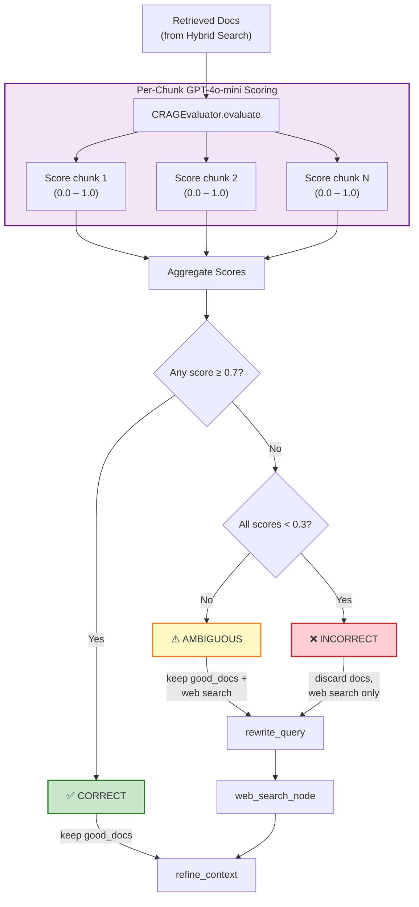

# 09 — Corrective RAG (CRAG) Evaluation Pipeline

**Module:** `app/core/crag/evaluator.py` · `app/core/crag/web_search.py`
**LLM:** `get_memory_llm()` — defaults to `llama-3.3-70b-versatile` via LiteLLM Router (not `gpt-4o-mini`)
**Thresholds:** upper = 0.7, lower = 0.3

---

## Overview

The **Corrective RAG (CRAG)** pipeline is a post-retrieval quality gate that evaluates whether the retrieved document chunks actually answer the user's question. Each chunk is scored independently by GPT-4o-mini, and the aggregate score determines one of three verdicts: **CORRECT**, **AMBIGUOUS**, or **INCORRECT**. Based on the verdict, the pipeline either proceeds with the good documents, supplements them with web search results, or discards them entirely and falls back to web search via the Tavily API.

This mechanism prevents the RAG pipeline from generating hallucinated answers grounded in irrelevant retrieved context — a critical failure mode in production RAG systems.

---

## CRAG Decision Flow



---

## Key Components

### CRAGEvaluator

Defined in [evaluator.py](file:///c:/Users/manis/Downloads/Agentic-AI/IDOP/app/core/crag/evaluator.py):

- **Scoring LLM:** `get_memory_llm()` with structured output (`DocEvalScore`). Defaults to `llama-3.3-70b-versatile` via the LiteLLM Router (Groq primary, OpenAI gpt-4o-mini fallback)
- **Per-chunk evaluation:** Each chunk is scored independently via `asyncio.gather` for parallel execution
- **Score schema:** `DocEvalScore(score: float [0.0–1.0], reason: str)`
- **Thresholds:** Configurable via `settings.crag_upper_threshold` and `settings.crag_lower_threshold`

### Scoring Guide

The prompt instructs the scoring LLM to score conservatively:

| Score | Meaning |
|---|---|
| **1.0** | Chunk alone is sufficient to fully answer the question |
| **0.7** | Chunk contains strong, directly relevant information |
| **0.5** | Chunk is partially relevant (related topic, incomplete answer) |
| **0.3** | Chunk is marginally relevant (same domain, no direct answer) |
| **0.0** | Chunk is completely irrelevant |

### Verdict Aggregation Logic

```python
# From evaluator.py — actual aggregation logic
if any(s >= upper_threshold for s in scores):
    verdict = "CORRECT"
elif all(s < lower_threshold for s in scores):
    verdict = "INCORRECT"
    good_docs = []        # discard all
else:
    verdict = "AMBIGUOUS"

# good_docs = chunks with score > lower_threshold (0.3)
```

| Verdict | Condition | Action |
|---|---|---|
| **CORRECT** | At least one chunk scored ≥ 0.7 | Keep `good_docs` → proceed to `refine_context` |
| **AMBIGUOUS** | No chunk ≥ 0.7, but not all < 0.3 | Keep `good_docs` AND trigger web search for supplementary context |
| **INCORRECT** | All chunks scored < 0.3 | Discard all docs → trigger web search as sole source |

---

## Web Search Fallback

### WebSearchService

Defined in [web_search.py](file:///c:/Users/manis/Downloads/Agentic-AI/IDOP/app/core/crag/web_search.py):

1. **Query Rewriting:** GPT-4o-mini reformulates the user's question into a focused web-search query (6–14 keywords)
2. **Tavily Search:** Calls Tavily Search API with `max_results=5` (configurable via `settings.tavily_max_results`)
3. **Result Parsing:** Each web result is converted to a LangChain `Document` with structured metadata

```python
# Web search document format
Document(
    page_content="TITLE: ...\nURL: ...\nCONTENT:\n...",
    metadata={"title": "...", "url": "...", "source": "..."}
)
```

### Query Rewrite Prompt

The rewrite prompt enforces focused, search-optimized queries:
- Short: 6–14 keywords
- Time-aware: adds temporal constraints if the question implies recency
- Does NOT answer the question — only reformulates for search

---

## Graph Routing Function

The [route_after_crag](file:///c:/Users/manis/Downloads/Agentic-AI/IDOP/app/core/graph/nodes.py) function determines the next node based on the verdict:

```python
def route_after_crag(
    state: CSRAGState,
) -> Literal["refine_context", "rewrite_query", "web_search"]:
    verdict = state["crag_verdict"]
    if verdict == "CORRECT":
        return "refine_context"
    elif verdict == "AMBIGUOUS":
        # AMBIGUOUS: internal docs partially relevant — go directly to web search
        # to supplement, skipping the query rewrite LLM round-trip.
        return "web_search"
    return "rewrite_query"
```

### CRAG Routing Paths

| Verdict | Next Node | Then |
|---|---|---|
| `CORRECT` | `refine_context` | Direct to context refinement → answer generation |
| `AMBIGUOUS` | `web_search` (direct, no query rewrite) → `refine_context` | Web supplements good_docs |
| `INCORRECT` | `rewrite_query` → `web_search` → `refine_context` | Web docs replace all docs (query rewritten first) |

### Context Merging in refine_context

The [refine_context_node](file:///c:/Users/manis/Downloads/Agentic-AI/IDOP/app/core/graph/nodes.py) merges documents based on verdict:

```python
if verdict == "CORRECT":
    docs_to_use = good_docs           # internal docs only
elif verdict == "INCORRECT":
    docs_to_use = web_docs            # web docs only
else:  # AMBIGUOUS
    docs_to_use = good_docs + web_docs  # both sources combined
```

---

## Data Flow

```
Hybrid Search Results (4 docs)
        │
        ▼
┌──────────────────────────┐
│   CRAGEvaluator.evaluate │
│                          │
│   asyncio.gather(        │
│     _score_doc(chunk_1), │ ──→ score=0.82, reason="..."
│     _score_doc(chunk_2), │ ──→ score=0.45, reason="..."
│     _score_doc(chunk_3), │ ──→ score=0.12, reason="..."
│     _score_doc(chunk_4), │ ──→ score=0.67, reason="..."
│   )                      │
│                          │
│   good_docs = [c1, c2, c4]  (score > 0.3)
│   verdict = "CORRECT"       (c1 ≥ 0.7)
└──────────────────────────┘
        │
        ▼
   refine_context_node
        │
        ▼
   generate_answer_node
```

---

## Performance Characteristics

| Metric | Value |
|---|---|
| **Scoring LLM** | `get_memory_llm()` — defaults to `llama-3.3-70b-versatile` |
| **Parallel scoring** | All chunks evaluated concurrently via `asyncio.gather` |
| **Typical latency** | 0.5–1.5s for 4 chunks (parallel) |
| **Web search latency** | Additional 1–3s when triggered |
| **Web results cap** | 5 results max (Tavily API) |
| **Error handling** | Failed chunk evaluations default to score 0.0 |
| **Tavily API key** | Required in `.env` as `TAVILY_API_KEY` |

---

## Related Workflows

- [08-hybrid-search.md](./08-hybrid-search.md) — Retrieval stage that produces the docs CRAG evaluates
- [10-srag-pipeline.md](./10-srag-pipeline.md) — Post-generation verification that follows CRAG
- [06-feature3-rag-pipeline.md](./06-feature3-rag-pipeline.md) — End-to-end RAG pipeline containing CRAG
- [07-langgraph-state-machine.md](./07-langgraph-state-machine.md) — Graph routing that calls `route_after_crag`
