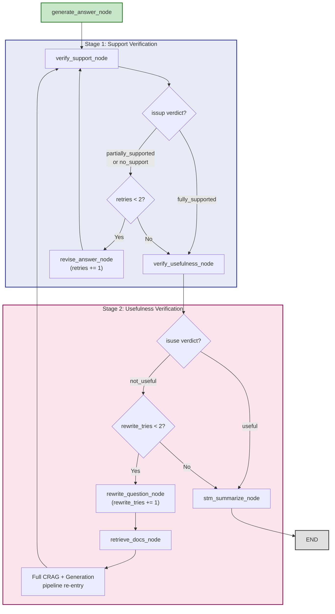

# 10 — Self-Reflective RAG (SRAG) Verification Pipeline

**Module:** `app/core/srag/verifier.py` · `app/core/graph/nodes.py`
**LLM:** GPT-4o-mini (verification / revision)
**Max retries:** Support revision = 2, Question rewrite = 2

---

## Overview

The **Self-Reflective RAG (SRAG)** pipeline is a post-generation quality gate that runs **after** the answer has been generated. It performs two sequential verification stages:

1. **Support Verification** — Is the generated answer actually grounded in the retrieved context?
2. **Usefulness Verification** — Is the final answer actually useful to the user?

Each stage can trigger a self-correction loop: failed support verification routes to answer revision, and failed usefulness verification routes to question rewriting followed by re-retrieval. These loops have configurable retry limits to prevent infinite cycles.

SRAG ensures that IDOP never returns an answer that is either unsupported by evidence or unhelpful to the user — the two most common failure modes in production RAG systems.

---

## Self-Correction Loop Diagram



---

## Key Components

### SRAGVerifier

Defined in [verifier.py](file:///c:/Users/manis/Downloads/Agentic-AI/IDOP/app/core/srag/verifier.py):

- **LLM:** GPT-4o-mini with structured output
- **Three chains:** `_support_chain`, `_usefulness_chain`, `_revise_chain`
- **Error handling:** On failure, defaults to `fully_supported` / `useful` (fail-open to prevent blocking)

### Stage 1: Support Verification

The `verify_support` method checks if every claim in the generated answer is traceable to the retrieved context.

**Input:** question + context + answer
**Output:** `SupportDecision`

```python
class SupportDecision(BaseModel):
    verdict: Literal["fully_supported", "partially_supported", "no_support"]
    evidence: list[str]  # Short direct quotes from context (max 20 words each)
```

| Verdict | Meaning |
|---|---|
| `fully_supported` | Every claim in the answer is backed by the context |
| `partially_supported` | Some claims are backed, others are not |
| `no_support` | The answer contradicts or ignores the context |

### Stage 2: Usefulness Verification

The `verify_usefulness` method checks if the answer actually addresses the user's question.

**Input:** question + answer (no context — evaluates from user's perspective)
**Output:** `UsefulnessDecision`

```python
class UsefulnessDecision(BaseModel):
    verdict: Literal["useful", "not_useful"]
    reason: str  # One-sentence justification
```

| Verdict | Meaning |
|---|---|
| `useful` | The answer clearly and directly addresses the question |
| `not_useful` | The answer is vague, off-topic, generic, or incomplete |

### Answer Revision

The `revise_answer` method rewrites the answer to improve factual grounding:

- Removes or qualifies claims not backed by context
- Does NOT add new information
- Keeps the answer concise and helpful
- Uses GPT-4o-mini with the `_REVISE_PROMPT`

---

## Graph Routing Functions

### route_after_support

Defined in [nodes.py](file:///c:/Users/manis/Downloads/Agentic-AI/IDOP/app/core/graph/nodes.py#L783-L788):

```python
def route_after_support(state) -> Literal["revise_answer", "verify_usefulness"]:
    issup = state.get("issup", "fully_supported")
    retries = state.get("retries", 0)
    if issup != "fully_supported" and retries < settings.srag_max_retries:  # max=2
        return "revise_answer"
    return "verify_usefulness"
```

### route_after_usefulness

Defined in [nodes.py](file:///c:/Users/manis/Downloads/Agentic-AI/IDOP/app/core/graph/nodes.py#L791-L796):

```python
def route_after_usefulness(state) -> Literal["rewrite_question", "stm_summarize"]:
    isuse = state.get("isuse", "useful")
    rewrite_tries = state.get("rewrite_tries", 0)
    if isuse == "not_useful" and rewrite_tries < settings.max_rewrite_tries:  # max=2
        return "rewrite_question"
    return "stm_summarize"
```

---

## State Variables

| Variable | Type | Purpose |
|---|---|---|
| `issup` | `str` | Support verdict: `fully_supported`, `partially_supported`, `no_support` |
| `evidence` | `list[str]` | Evidence quotes extracted from context |
| `retries` | `int` | Number of answer revision attempts (max 2) |
| `isuse` | `str` | Usefulness verdict: `useful`, `not_useful` |
| `use_reason` | `str` | One-sentence justification for usefulness verdict |
| `rewrite_tries` | `int` | Number of question rewrite attempts (max 2) |

---

## Self-Correction Paths

### Path 1: Happy Path (No Corrections)

```
generate_answer → verify_support (fully_supported)
    → verify_usefulness (useful)
    → stm_summarize → END
```
**LLM calls:** 1 (support) + 1 (usefulness) = **2 extra calls**

### Path 2: Answer Revision (Support Failure)

```
generate_answer → verify_support (partially_supported)
    → revise_answer (retries=1)
    → verify_support (fully_supported)
    → verify_usefulness (useful)
    → stm_summarize → END
```
**LLM calls:** 1 + 1 (revision) + 1 (re-verify) + 1 (usefulness) = **4 extra calls**

### Path 3: Question Rewrite (Usefulness Failure)

```
generate_answer → verify_support (fully_supported)
    → verify_usefulness (not_useful)
    → rewrite_question (rewrite_tries=1)
    → retrieve_docs → evaluate_docs → ... → generate_answer
    → verify_support → verify_usefulness (useful)
    → stm_summarize → END
```
**LLM calls:** Full pipeline re-execution + verification = **many calls**

### Path 4: Maximum Retries Exhausted

```
generate_answer → verify_support (no_support)
    → revise_answer (retries=1)
    → verify_support (partially_supported)
    → revise_answer (retries=2)
    → verify_support (still partial) → [retries=2, max reached]
    → verify_usefulness (not_useful)
    → rewrite_question (rewrite_tries=1) → ...
    → verify_usefulness (not_useful)
    → rewrite_question (rewrite_tries=2) → ...
    → verify_usefulness (still not_useful) → [max reached]
    → stm_summarize → END
```
**Worst case:** 2 revisions + 2 rewrites = up to **4 correction loops**

---

## Data Flow

```
Answer (from generate_answer_node)
    │
    ▼
verify_support_node
    ├── Input: question + refined_context + answer
    ├── Output: issup = "fully_supported" | "partially_supported" | "no_support"
    └── Output: evidence = ["quote1", "quote2", ...]
    │
    ▼
route_after_support
    ├── if issup != "fully_supported" AND retries < 2
    │       └── revise_answer_node → retries += 1 → back to verify_support
    └── else
            │
            ▼
        verify_usefulness_node
            ├── Input: question + answer
            ├── Output: isuse = "useful" | "not_useful"
            └── Output: use_reason = "..."
            │
            ▼
        route_after_usefulness
            ├── if isuse == "not_useful" AND rewrite_tries < 2
            │       └── rewrite_question_node → rewrite_tries += 1 → retrieve_docs
            └── else
                    └── stm_summarize_node → END
```

---

## Performance Characteristics

| Metric | Value |
|---|---|
| **Verification LLM** | GPT-4o-mini (fast, cheap) |
| **Support check latency** | ~0.5–1.0s |
| **Usefulness check latency** | ~0.3–0.8s |
| **Answer revision latency** | ~0.8–1.5s |
| **Max support retries** | 2 (configurable: `settings.srag_max_retries`) |
| **Max question rewrites** | 2 (configurable: `settings.max_rewrite_tries`) |
| **Worst-case total loops** | 4 (2 revisions + 2 rewrites) |
| **Error fallback** | Defaults to `fully_supported` / `useful` on LLM errors |
| **Recursion limit** | 80 (set in `CSRAGEngine._RECURSION_LIMIT`) |

---

## Related Workflows

- [09-crag-pipeline.md](./09-crag-pipeline.md) — CRAG evaluation that runs before answer generation
- [06-feature3-rag-pipeline.md](./06-feature3-rag-pipeline.md) — End-to-end RAG pipeline containing SRAG
- [07-langgraph-state-machine.md](./07-langgraph-state-machine.md) — Graph edges for SRAG routing
- [11-memory-system.md](./11-memory-system.md) — STM summarization that follows SRAG completion
