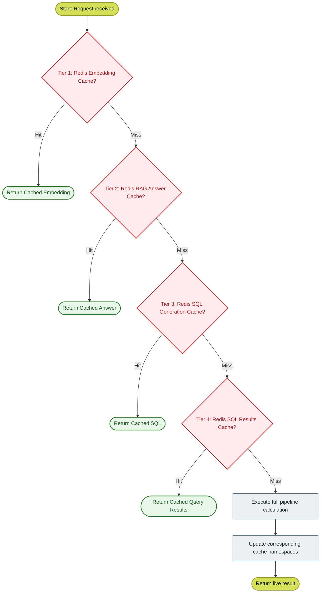

# 12-multi-level-cache: Four-Tier Caching Strategy

This workflow explains the design, key namespaces, TTL policies, and high-performance deduplication logic powering the IDOP **Four-Tier Caching System**.

---

## Overview

High-frequency enterprise applications face tight constraints regarding API latency, service cost, and rate-limiting limits. Under standard RAG pipelines, repeated user requests would trigger redundant LLM reasoning, vector embeddings, external web crawls, and database sweeps.

IDOP introduces a strict **Multi-Level Cache System** to bypass duplicate calculations. This includes a distributed `Upstash Redis` instance for low-latency key-value queries and a document-level chunk cache (via S3 or local disk storage) mapped by file SHA-256 hashes.



---

## The Four-Tier Cache Structure

The distributed Redis layer is structured into four distinct namespaces, each mapped to optimized Time-to-Live (TTL) policies reflecting the volatility of their underlying data:

| Cache Tier | Key Pattern | TTL | Eviction Rationale |
| :--- | :--- | :--- | :--- |
| **Tier 1: Embedding Cache** | `embedding:{sha256}` | **7 Days** (604,800s) | Embedding patterns for identical phrases are highly static. |
| **Tier 2: RAG Answer Cache** | `rag:{sha256_query}:{top_k}` | **1 Hour** (3,600s) | RAG contexts change as repositories are updated, requiring periodic re-evaluation. |
| **Tier 3: SQL Query Cache** | `sql_gen:{sha256_query}` | **24 Hours** (86,400s) | Translating English questions to SQL queries remains stable unless DB schemas alter. |
| **Tier 4: SQL Results Cache** | `sql_result:{sha256_sql}` | **15 Minutes** (900s) | Business database states are volatile. Fast updates prevent dirty read anomalies. |

---

## Document-Level Storage Caching

When a new document (PDF, CSV, Excel) is uploaded through `/upload`, the file content is instantly hashed using `SHA-256` to establish its unique `document_id`.

Before initiating parsing or dual-vector indexing:
1.  **Deduplication Check**: The system asks the active `StorageBackend` (S3 or local disk) if files under `pdf/{document_id}/chunks.json` already exist.
2.  **Point Search**: If they exist, parsing, chunking, and embedding calculations are completely bypassed. Chunks and embeddings are loaded straight from the storage cache into Qdrant or directly into the RAG engine context.

```python
# app/services/query_cache_service.py (simplified key generation)
def _compute_hash(self, text: str) -> str:
    return hashlib.sha256(text.strip().encode()).hexdigest()

# Individual key builders:
def get_embedding_key(self, text: str) -> str:
    return f"embedding:{self._compute_hash(text)}"

def get_rag_key(self, question: str, top_k: int) -> str:
    return f"rag:{self._compute_hash(question.lower())}:{top_k}"

def get_sql_gen_key(self, question: str) -> str:
    return f"sql_gen:{self._compute_hash(question.lower())}"

def get_sql_result_key(self, sql_query: str) -> str:
    normalized = " ".join(sql_query.strip().lower().split())
    return f"sql_result:{self._compute_hash(normalized)}"
```

---

## Local In-Memory Fallback (Graceful Degradation)

To preserve system resilience, the `QueryCacheService` is designed to degrade gracefully if connectivity with Upstash Redis is severed. 

If a connection timeout occurs:
1.  The exception is captured silently without breaking the active request.
2.  The engine falls back to a shared local in-memory dictionary (`self._local_cache: Dict[str, str]`).
3.  Metrics tracking marks `redis_status: "disconnected"` and updates health checks.

```python
# app/services/query_cache_service.py (simplified)
class QueryCacheService:
    _local_cache_shared: ClassVar[dict[str, str]] = {}  # shared across instances

    def __init__(self, redis_url=None, redis_token=None):
        self.enabled = False
        self.client = None
        self.use_local = False
        self._local_cache = self._local_cache_shared

        if redis_url and redis_token:
            try:
                from upstash_redis import Redis
                self.client = Redis(url=redis_url, token=redis_token)
                self.client.ping()
                self.enabled = True
            except Exception:
                self.use_local = True  # fall back to local in-memory
        else:
            self.use_local = True

    def get(self, key: str, cache_type: str = "rag") -> dict | None:
        # Local in-memory fallback
        if self.use_local:
            if key in self._local_cache:
                return self._deserialize(self._local_cache[key])
            return None

        # Redis (synchronous — Upstash Redis uses REST API, not async)
        try:
            result = self.client.get(key)
            if result is not None:
                return self._deserialize(result)
            return None
        except Exception:
            return None

    def set(self, key: str, value: dict, ttl: int, cache_type: str = "rag") -> bool:
        serialized = self._serialize(value)
        if self.use_local:
            self._local_cache[key] = serialized
            return True
        try:
            self.client.setex(key, ttl, serialized)
            return True
        except Exception:
            return False
```

---

## Cache Invalidation Endpoint

Administrative operations or content updates can enforce cache sweeps using the `/cache/clear` API:

*   **`DELETE /cache/clear`**: Clear all four tiers of Redis caching globally.
*   **`DELETE /cache/clear?doc_id=hash&file_extension=pdf`**: Clear a specific document's chunk cache.
*   **`DELETE /cache/clear?clear_query_cache=false`**: Clear document cache without flushing Redis query cache.

Additional cache endpoints:
*   **`GET /cache/stats`**: Returns statistics for both document and query caches (hit rates, sizes, backend info).
*   **`GET /cache/health`**: Performs connectivity checks on both document storage and query cache backends.
*   **`POST /cache/test`**: Runs a write-read-delete round-trip test to validate cache backend functionality.

### PendingStore (Cross-Worker Pending Operations)

The `pending_queries` and `pending_mutations` stores (used for approval workflow) now use a **`PendingStore`** class backed by **Redis** as the canonical store, with Postgres and in-memory dict as fallbacks. This ensures all uvicorn workers see the same pending data:

```python
from app.services.pending_store import pending_queries, pending_mutations

# Redis-first, with auto-expiry (1 hour TTL)
pending_queries[query_id] = {"sql": "...", "status": "pending_approval"}
```

---

## Related Workflows

*   [03-document-upload-pipeline](./03-document-upload-pipeline.md) - Document hashing and storage caching.
*   [06-feature3-rag-pipeline](./06-feature3-rag-pipeline.md) - RAG query caching.
*   [13-service-initialization](./13-service-initialization.md) - Lifespan setup of cache clients.
