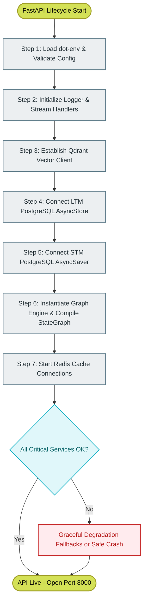

# 13-service-initialization: Lifecycle & Startup Sequence

This document describes the initialization sequence, dependency ordering, environment validations, and graceful degradation paths executed during the FastAPI application lifecycle.

---

## Overview

A complex platform incorporating dual vector databases, relational storage checkpointers, message queues, checkpointer engines, and deep external integrations must possess a highly predictable startup cycle. 

IDOP coordinates service instantiation inside a unified **FastAPI Lifespan Context Manager**. This sequence prevents race conditions (e.g., trying to compile the LangGraph state machine before checkpointer tables are instantiated in the PostgreSQL container) and enforces strict validation checks before admitting client traffic.



---

## Startup Sequence & Execution Steps

Upon initiation of Uvicorn, the context manager triggers the following sequential pipeline:

### Step 1: Configuration Loading and Pydantic Validation
The environment variables from `.env` are parsed and loaded into Pydantic Settings (`Settings` inside `app/config.py`).
```python
# Validation checks at startup
settings = get_settings()
if not settings.OPENAI_API_KEY:
    raise ConfigurationError("Missing critical API key: OPENAI_API_KEY. Shutting down.")
```

### Step 2: Structured Logging Setup
`setup_logging()` is fired, initializing `loguru` stream interceptors. It intercepts standard library warning outputs and formats trace details into consistent JSON structures, outputting directly to stdout/stderr.

### Step 3: Vector Store Registration
The `VectorStoreService` connects to the Qdrant instance. It checks if the primary collection `idop_documents` exists. If the collection is missing, it executes automated schema creation, applying:
*   Dense named vector payload configuration (Cosine, 1536-dim).
*   Sparse named vector payload configuration (BM25 keyword vectors).

### Step 4: Long-Term Memory (LTM) Setup
The `AsyncPostgresStore` establishes async pooling on the database URL. It runs:
```python
# Setup PostgreSQL schema structures for agent stores
async with store:
    await store.setup()
```
This checks if the tables representing agent memories are built and handles migrations automatically.

### Step 5: Short-Term Memory (STM) Checkpointer Setup
The `AsyncPostgresSaver` checkpointer initializes parallel connection pools. It compiles graph save states, ensuring the tables holding checkpoints for agent steps exist.

### Step 6: LangGraph Engine Assembly
The `CSRAGEngine` is constructed by feeding it the `VectorStoreService`, LTM `AsyncPostgresStore`, and STM `AsyncPostgresSaver`. The LangGraph compilations are executed, producing a thread-safe executable state machine.

### Step 7: Redis Cache Hook
The application tries to connect to the external Upstash Redis server. If the handshakes are verified, cache routines are attached to the API scope.

---

## Graceful Degradation Paths (Fault-Tolerance)

IDOP is designed to remain partially operational during external service outages:

> [!NOTE]
> **Redis Outage**
> If Redis cannot be reached at startup, the system issues a warning logs, prints `redis_status: "degraded"`, and seamlessly falls back to local in-memory dictionaries for all cache tiers.
>
> **S3 Storage Failure**
> In developmental environments, if AWS S3 connections fail, document storage fallbacks are redirected to local directories (`./cache_dir/`), allowing local debugging without cloud setups.
>
> **Voyage AI Offline**
> If Voyage AI endpoints fail during RAG lookups, the system automatically bypasses the reranking node and forwards top-ranked raw hybrid vectors straight to context windowing.

---

## Health Check Endpoint (`/health`)

Once startup steps complete, service statuses are continuously queried and exposed through the `/health` API.

### Response JSON Sample
```json
{
  "status": "healthy",
  "version": "1.0.0",
  "timestamp": "2026-05-25T12:00:00Z",
  "services": {
    "supabase_postgresql": {
      "status": "connected",
      "latency_ms": 12.4
    },
    "internal_postgresql": {
      "status": "connected",
      "latency_ms": 8.1
    },
    "qdrant_cloud": {
      "status": "connected",
      "latency_ms": 22.8
    },
    "upstash_redis": {
      "status": "connected",
      "latency_ms": 15.3
    },
    "openai_api": {
      "status": "available"
    },
    "voyage_api": {
      "status": "degraded",
      "reason": "API Latency Spike"
    }
  }
}
```

---

## Related Workflows

*   [01-system-architecture](./01-system-architecture.md) - Learn how FastAPI coordinates these blocks.
*   [07-langgraph-state-machine](./07-langgraph-state-machine.md) - Graph compilation configuration details.
*   [12-multi-level-cache](./12-multi-level-cache.md) - Graceful degradation caching fallbacks.
