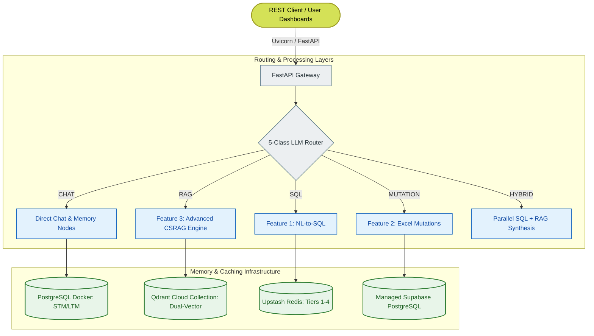

# IDOP System Design Document & Architectural Rationale

This document provides a highly structured overview of the architectural decisions, design philosophies, security mitigations, and stakeholder defense narratives powering the **Intelligent Data Operations Platform (IDOP)**.

---

## 🏗️ Core Architectural Component Layout

---

## 🏛️ Decision Records & Rationales

### 1. Unified StateGraph Compilation (LangGraph)
*   **Decision**: Compiling the entire three-feature pipeline into a unified cyclic **LangGraph StateGraph** instead of linear chain frameworks (CrewAI, AutoGen, or LangChain chains).
*   **Rationale**: Linear chains are unable to execute cyclic self-correction (such as routing a query back to synthesis if the answer fails evidence checks). LangGraph maps the entire enterprise logic into discrete nodes and conditional edges. By integrating **PostgreSQL-backed checkpointers (`AsyncPostgresSaver`)**, session contexts and pending approval sessions are ACID-persistable, making the application fully resilient.

### 2. Dual-Vector Hybrid Search and Voyage AI Rerank-2.5
*   **Decision**: Deploying dense + sparse named vector indexing inside Qdrant and fusing scores with Reciprocal Rank Fusion (RRF), followed by Voyage AI cross-encoder reranking.
*   **Rationale**: 
    - **Dense vectors** (Nomic `nomic-embed-text-v1.5`) capture conceptual meaning but miss exact identifiers (SKU codes, serial numbers, email strings).
    - **Sparse vectors** (BM25 keyword tokens) catch alphanumeric exact matches. Fusing them via RRF ($k=60$) guarantees high-precision document extraction.
    - **Voyage AI Rerank-2.5** analyzes raw query-document syntax cross-relations, ensuring that the highest-context paragraphs are fed into the prompt's first 500 tokens (minimizing LLM context degradation).

### 3. Four-Tier Caching with Graceful Degradation
*   **Decision**: Implementing four namespaces in Upstash Redis (`embedding` 7d, `rag` 1h, `sql_gen` 24h, `sql_result` 15min) paired with a thread-safe LRU Local Memory Fallback.
*   **Rationale**: Enterprise APIs are subject to high costs and rate limit constraints. Query-level caching cuts latencies below 10ms for duplicate queries. If the Redis server experiences an outage, the system captures the exception silently, marks the connection status as degraded, and redirects cache queries to the local dictionary without interrupting Uvicorn threads.

---

## 🛡️ Trust & Security Mitigations

> [!IMPORTANT]
> **1. The SQLValidator Firewall**
> Relying on LLM system instructions to avoid security breaches is a known vulnerability. IDOP implements a programmatic, regex-based SQL validator in [sql_validator.py](file:///c:/Users/manis/Downloads/Agentic-AI/IDOP/app/core/feature1_sql/sql_validator.py). It acts as an absolute firewall blocking SQL injections or destructive operations (`DROP`, `TRUNCATE`, `ALTER`, etc.) before any query reaches execution.
>
> **2. Human-In-The-Loop Approval Gates**
> High-risk operations (such as SQL writes or sheet mutations) are intercepted. The platform generates a unique cryptographic hex token, persists the session in **Redis** (with 1-hour auto-expiry), and puts the session in a `pending` state. If Redis is unavailable, it falls back to an in-memory cache with PostgreSQL persistence. Execution only proceeds when the secure token is verified via `/sql/approve/{token}`.
>
> **3. All-or-Nothing Mutation Transactions**
> In bulk Excel/CSV employee mutations, any single-row business rules failure (e.g. out-of-bounds salary limit in `rules.json`) will throw an exception. The system runs everything inside an isolated transactional database block (`async with db_session.begin():`), ensuring immediate rollbacks and preventing corrupted partial writes.

---

## 📖 Key Stakeholder Defense Q&A

### Q1: Why use AWS EC2 with Docker Compose instead of AWS Lambda Serverless?
> **Answer**: IDOP's human-in-the-loop design allows SQL writes or mutations to remain in a `pending` state for hours while waiting for admin sign-offs. Serverless functions (like AWS Lambda) are ephemeral, enforce a 15-minute runtime ceiling, and discard internal states between invocations. A containerized environment ensures that long-lived sessions are securely cached and state checkpointers are pooled.

### Q2: Vanna 2.0 is the primary Text-to-SQL engine. What is our fallback plan if Vanna fails?
> **Answer**: While Vanna excels at indexing Golden Examples inside its vectorstore, it can encounter retrieval ceilings on unfamiliar prompts. IDOP implements an automated fallback in `TextToSQLService`. If Vanna throws an exception, the system instantly triggers direct `gpt-4o` schema-based generation using stored DDLs, guaranteeing constant availability.

### Q3: How is Short-Term Memory (STM) prevented from overloading LLM context windows?
> **Answer**: IDOP uses an automated STM compressor node (`stm_summarize`). When a thread's message history exceeds **6 interactions**, the system prompts `gpt-4o-mini` to summarize the oldest dialogues into a dense context string. This summary is prepended to the system prompt, and the compressed history is cleared from the active state, saving thousands of tokens per run.
